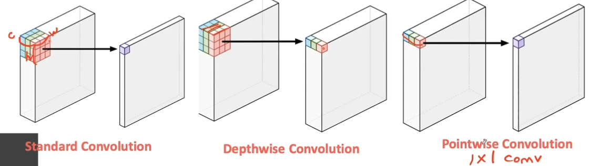
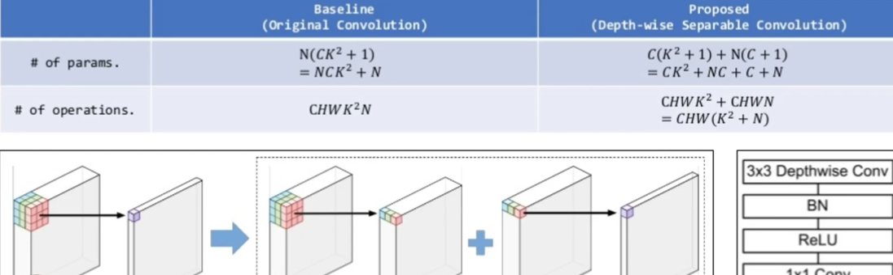
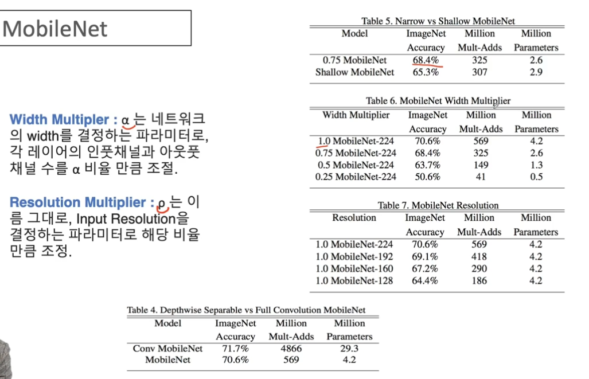

# Mobile Net 
> 모델 경량화에 초점
## CNN의 발전방향
모델의 크기(용량), 연산량은 줄이면서 accuracy는 높이기

## Mobile Net 구조
- 일반적인 CNN의 구조엔 
  - 3*3 Convlution - Batch Normalization - ReLU
- MobileNet은 
  - 3* 3 Depthwise separable Convlution(경량화에 큰 도움) - Batch Normalization - ReLU - 1*1 Convolution - Batch Normalization - ReLU

## Depthwise Seperable Convolution

- Depthwise Convolution + Pointwise convolution

> 기존방식보다 줄어드는 params와 operation을 보여줌
> 

### Depthwise convolution
- 각 채널을 분리하여 각각 연산하여 sepcific한 정보를 추출하여 concatence하는 것
- 이 때, stride = 1로 하여 reduction을 하지 않고 원래 input 사이즈를 유지

### Pointwise convolution
- 위 과정에서 나온 Output을 채널방향으로 1*1 뽑아내어 연산

