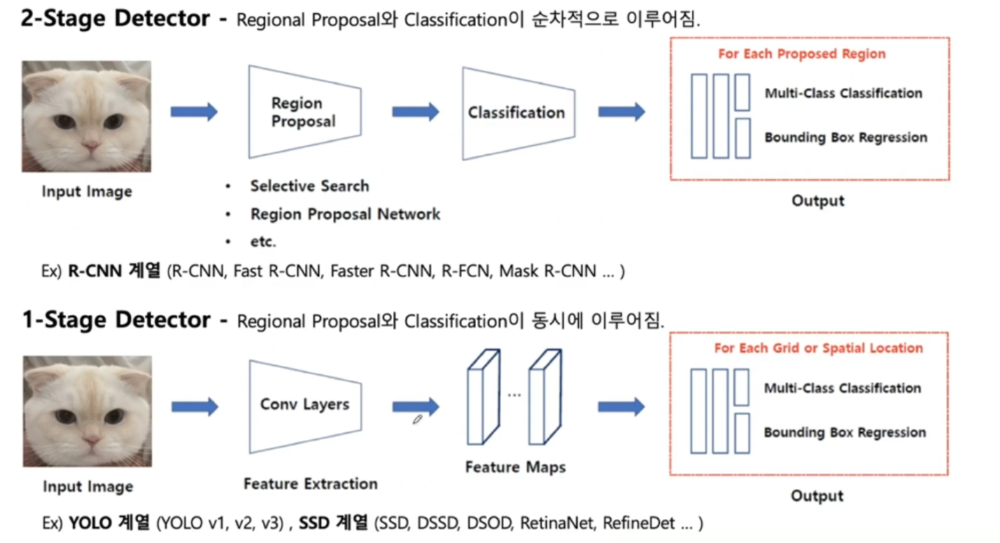
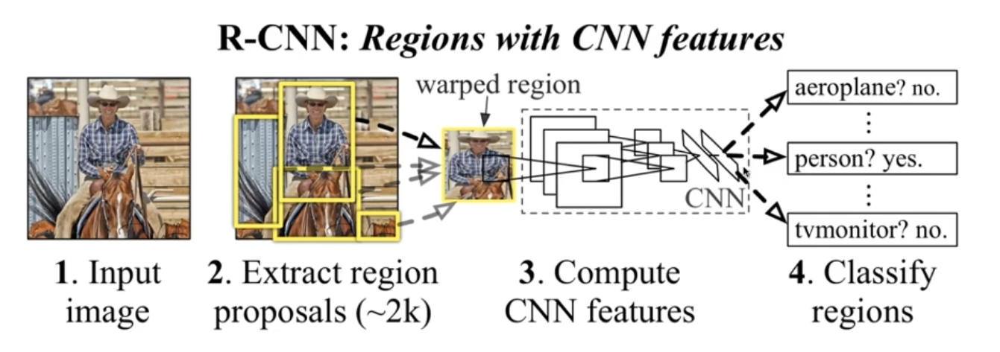

# Image Object Detection
### 2-Stage Detector
- Regional Proposal, Classification이 순차적으로 이루어짐
  - R-CNN 계열 (R-CNN, Fast R-CNN, Faster R-CNN, R-FCN, Mask R-CNN)

### 1-Stage Detector
- Regional Proposal 과 Classification이 동시에 이루어짐
  - YOLO, SSD 계열

---
# RCNN

- Region Proposal
  - 카테고리와 무관하게 물체의 영역을 찾는 모듈
  - Selective Search
    - 객체와 주변간의 색, 질감 등의 차이를 파악하여 바운딩박스를 랜덤하게 많이 생성하고 이들을 조금씩 merge해나가면서 물체 인식
- CNN
  - CNN의 input에 맞게 모든 박스이미지들을 넣음
    - 각각의 region proposal로부터 고정된 크기의 Feature Vector 생성
- Classification
  - 분류를 위한 선형 지도학습 모델(SVM)
> 오래 걸림(2000개의 바운딩 박스), 복잡함(CNN + SVM + Bouding Box Regression), Backpropagetion 안 됨