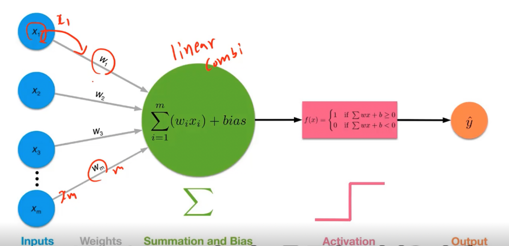
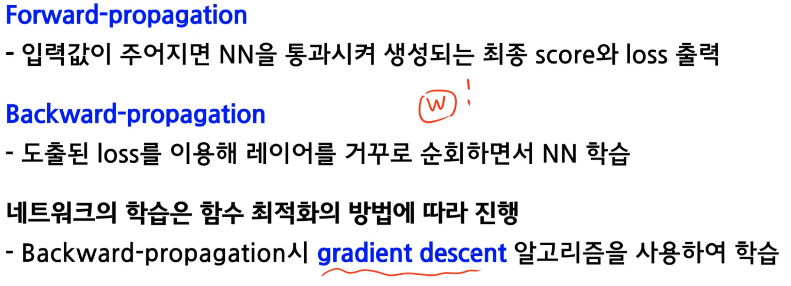

# why and what dl
50년대부터 AI, 70~80년대 ML, 80년대 처음으로 딥러닝 알고리즘이 나오며 10년대에 보편화
  
초반에는 if-else문으로 AI를 접근, but exception이 많이 발생  
-> 예전에는 모든 데이터들의 룰을 찾아서 만들면 현실 표현이 가능할 것이라 믿었음, but 불가능(사람이 모든 규칙을 찾기는 어려움)  

기존 data와 rule을 줘서 답을 찾는 형태에서 data와 answer을 주고 rules을 찾아내는 방식으로 변화  

사람이 모르는 특징 중 전체를 보고 스스로 중요한 것을 찾아낼 수 있을까라는게 딥러닝의 특징 -> 따라서 많은 data를 통해 학습한다

> 기존 ML에서는 사람이 직접 feature를 extraction했지만 DL에서는 많은 데이터셋을 주고 스스로 feature를 찾게 만듦

- AlexNet이라는 알고리즘이 나오면서 딥러닝이 많이 발달
- 많은 데이터
- GPU의 발전 (연산용 GPU)
- 오픈소스 

---
## DL
- 주로 뉴럴 네트워크 구조를 사용
- 방대한 데이터 + 높은 컴퓨터 성능 + 좋은 알고리즘

> perceptron의 구조(멀티 레이어 펄셉트론)
- activate function은 시그모이드 함수로 바꿔서 여러가지 시도

### multi layer perceptron
XOR구조도 다중 레이어로 구현이 가능한데, 과연 weight값을 어떻게 찾을 것인가?
> chain rule을 사용한 미분을 통해 Backpropagation을 이용

---
# DL introduction
## Key components of Deep learning
- data
- model
- loss function
- algorithm (loss function을 최소화하기 위한)
> 위 4가지 항목으로 논문을 주의깊게 보면 이해하기 쉬움

### data
- classifcation
- semantic Segmentation
  - 각 픽셀이 어떤걸 나타내는지
- Detection
  - 그림에서 각 boundary가 무엇인지
- Pose Estimation
- visual QnA
  - 질문을 던졌을 때 그림에서의 답을 받아내는 것

### Model
ex) AlexNet, GoogleNet, ResNet, DenseNet, LSTM, Deep AutoEncoders, GAN 등..

### Loss function
- 모델이 정해져있고 데이터가 있을 때 모델을 어떻게 학습할지에 관한 것
- 결국 딥러닝에서는 뉴럴넷을 활용하고, 이때 각 layer에서 weight와 bias를 업데이트할 때 기준이 된다
- 일반적으로 regression에서는 MSE를 쓰고 Classification에서는 cross entrophy를 사용, 또는 확률문제는 MLE등
> 데이터의 특성에 따라 적절한 loss function 정의가 중요

### Algorithm

## DL's history
- 2012 - AlexNet : 224*224 이미지 분류 대회에서 딥러닝을 이용해 처음으로 1등
- 2013 - DQN : 알파고의 알고리즘 (강화학습 - Q-learning + DL)
- 2014 - Encoder / Decoder : 번역문제를 위한 방법론 (인코더는 언어의 시퀀스를 어떤 벡터로 인코딩하고 다른 언어의 시퀀스로 만들게끔하는 디코더 : Seq2Seq)
- 2014 - Adam Optimizer : 웬만하면 잘 된다..
- 2015 - GAN : generate와 discriminate 를 이용해 학습
- 2015 - Residual Networks : 딥러닝이 딥러닝이 되도록, 네트워크를 깊게 쌓으면 테스트할 때 성능이 안 좋은 것이 일반적이였는데 이게 나온 이후 꽤 많은 네트워크를 쌓아도 성능이 괜찮게 나옴
- 2017 - Transformer(Attention is All You Need) : 기존의 방법론들의 대부분을 대체
- 2018 - BERT(fin-tuned NLP models) : 트랜스포머구조 + Bidirectional, 다양한 단어를 통해 pre-train시키고 내가 풀고자하는 소수의 데이터에 fine tuning을 하겠다
- 2019 - GPT-3 : 약간의 파인튜닝을 통해 문장 표 프로그램 등과 같은 시퀀스 모델을 만든다. 굉장히 많은 파라미터
- 2020 - Self Supervised Learning(simCLR) : 분류문제에서 학습데이터는 한정적인데 라벨이 주어져있지 않은 unsupervised 데이터를 같이 학습하겠다. 어떻게 하면 이미지를 컴퓨터가 이해할 수 있는 벡터로 바꿀 것인지에 대한 부분에서 비지도이미지를 같이 학습시켜서 하겠다.