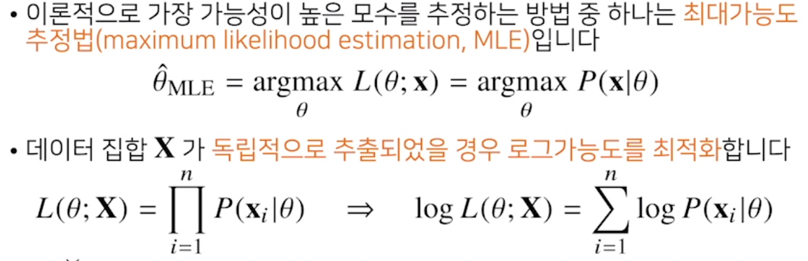

# 확률론
## 딥러닝에서 확률론의 필요성
- 딥러닝은 확률론 기반의 기계학습 이론에 바탕을 둠
- 기계학습에서 사용되는 손실함수(loss function)들의 작동 원리는 데이터 공간을 통계적으로 해석해서 유도
  - 예측이 틀릴 위험을 최소화하도록 데이터를 학습하는 원리는 통계적 기계학습의 기본 원리
- 회귀분석에서 손실함수로 사용되는 L2-norm은 예측오차의 분산을 가장 최소화하는 방향으로 학습하도록 유도
- 분류 문제에서 사용되는 cross-entropy는 모델 예측의 불확실성을 최소화하는 방향으로 학습하도록 유도
- 딥러닝은 다층신경망을 사용하여 데이터로부터 특징패턴 $\phi$ 를 추출하게됨

## 몬테카를로 샘플링
- 기계학습의 많은 문제들은 확률분포를 명시적으로 모르는게 대부분
- 확률분포를 모를 때 데이터를 이용하여 기대값을 계산하려면 몬테카를로 샘플링 방법을 사용(이산형, 연속형 상관없이 성립) 
  - 타겟으로 하는 f(x)에 데이터를 대입한 후에 산술평균을 계산, 단 독립적으로 샘플링해야함(대수의 법칙에 의해 수렴성을 보장)

[몬테카를로](https://m.blog.naver.com/rkdwnsdud555/220828040636)  
ex) 만약 파이를 모를 때
1. 넓이가 1인 정사각형 안에 반지름이 1인 4분원을 그린다  
2. 이때 4분원의 넓이는 x/4이다
3. 랜덤하게 다트를 m번던져서 원 안에 다트가 n개 들어온다면 원의 넓이는 대략적으로 x/4 = n/m
4. 즉, x = 4*n / m일 것이다

```python
import random
n=int(input("반복 횟수"))
count=0
for i in range(n):
    x=random.uniform(0, 1)
    y=random.uniform(0, 1)
    if (x ** 2 + y ** 2) <= 1:
        count = count + 1 
print("파이값은? ",4 * count / n)
```

---
## 최대가능도 추정법(우도)
- 이론적으로 가장 가능성이 높은 모수를 측정하는 방법 중 하나는 최대가능도 추정법(MLE)
- 확률밀도함수는 모수 $\theta$에 대해 x에 대한 함수로 해석
- 가능도함수는 주어진 데이터 x에 대해서 모수 $\theta$를 변수로 둔 함수로 해석
  - 데이터가 주어진 상황에서 $\theta$를 변형시킴에 따라 값이 바뀌는 함수로 이해
  - 가능도함수는 모수 $\theta$를 따르는 분포가 데이터 x를 관찰할 가능성을 뜻함($\theta$에 대한 확률로 해석 X -> 대소 관계 정도로 해석)
- 데이터 집합 X가 독립적으로 추출되었을 경우 로그가능도를 최적화


### 왜 로그가능도를 사용하나요?


### 최대가능도 추정법 예제: 정규분포


### 최대가능도 추정법 예제: 카테고리 분포


## 딥러닝에서 최대가능도 추정법
  
[ref](https://aigong.tistory.com/369)

---
## 확률분포의 거리 구하기


## 쿨백-라이블러 발산


---
# 베이지 통계학 맛보기
## 배이즈 정리를 통한 정보의 갱신
1. 양성이라 검진됐을 때, 실제 질병이 감염됐을 확률

2. 앞서 양성이 나온 사람이 두번째 검사에서도 양성이 나왔을 때 실제로 감염이 됐을 확률


---
## 인과관계 추론 : 예제
- 단순 수술 확률은 b가 좋을 수도 있지만 각각의 신장 결석 크기에 따른 관계를 배제하고 계산을 하면 a가 더 성공률이 높다

