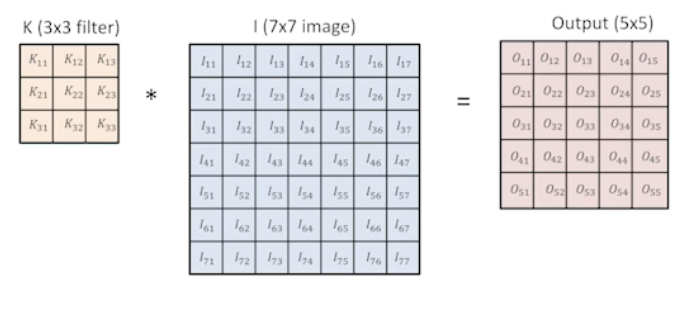

# CNN Basics
: convolution Neural Network

## Convolution
### 2D image convolution
$(I*K)(i,j)=\sum_{m}\sum_{n}I(m,n)K(i-m, j-n)=\sum_{m}\sum_{n}I(i-m, i-n)K(m,n)$
- I는 전체 이미지 공간, K는 convolution filter로 보면 됨

> 3x3 filter을 7x7 이미지에 convolution하면 5x5 output이 나오게 된다
> - 도장을 찍듯이 filter 이미지를 기존 이미지에 찍으면 3x3의 이미지와 해당 영역에 해당하는 7x7의 이미지 픽셀값이 곱해져 하나의 새로운 픽셀 값으로 아웃풋이 나옴
> - 그렇게 하나씩 하나씩 순차적으로 진행하면 5x5이미지가 나오게됨

> 의미론적으론 2D이미지의 경우 예를 들어 filter이미지가 1/3의 값을 가지는 픽셀값을 가지고 있다면 원본 이미지는 blur가 되는 효과가 된다

