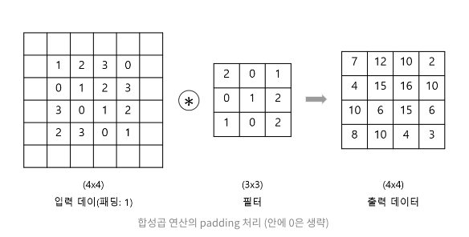
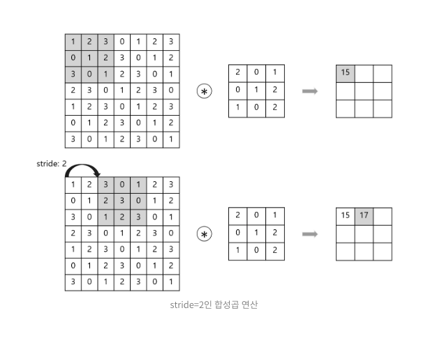
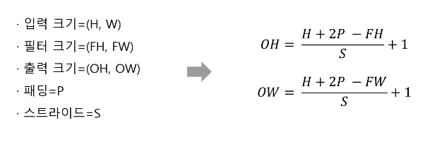
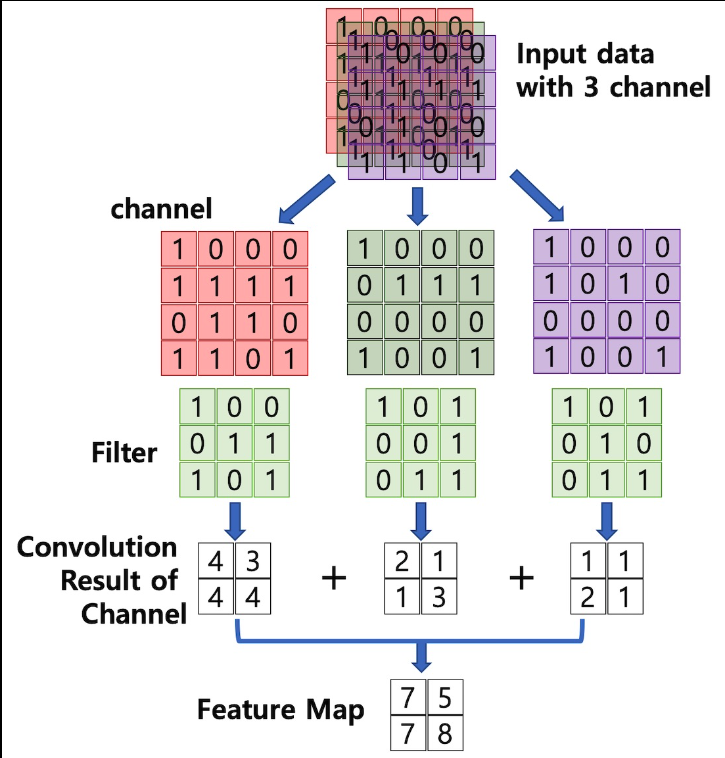
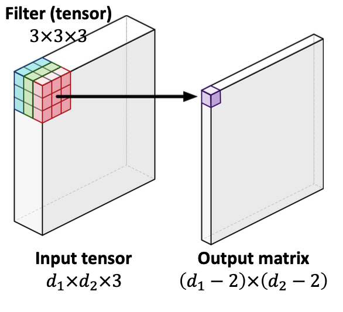

# CNN Basics
: convolution Neural Network

## Convolution
### 기존 MLP의 문제
- 기존 Multi-Layer Neural Network의 문제점은 `변수의 개수, 네트워크 크기, 학습시간` 세가지 문제가 발생
- 글자의 크기, 회전, 변형이 있게 되면, 이에 대한 새로운 학습데이터를 넣어줘야 하는 문제 존재
### Convolution layer
- 필기체나 MNIST 데이터 같은 이미지 데이터는 일반적으로 채널, 세로, 가로 3차원으로 구성된 데이터(`이미지의 경우 가로, 세로, 채널(RGB)`)
- 합성곱에서는 3차원 데이터(1, 28, 28)를 입력하고 3차원의 데이터로 출력하므로 형상을 유지, 이러한 입출력 데이터를 특징맵(feature map)
---
### 2D image convolution
$(I*K)(i,j)=\sum_{m}\sum_{n}I(m,n)K(i-m, j-n)=\sum_{m}\sum_{n}I(i-m, i-n)K(m,n)$
- I는 전체 이미지 공간, K는 convolution filter로 보면 됨

> 3x3 filter을 7x7 이미지에 convolution하면 5x5 output이 나오게 된다
> - 도장을 찍듯이 filter 이미지를 기존 이미지에 찍으면 3x3의 이미지와 해당 영역에 해당하는 7x7의 이미지 픽셀값이 곱해져 하나의 새로운 픽셀 값으로 아웃풋이 나옴
> - 그렇게 하나씩 하나씩 순차적으로 진행하면 5x5이미지가 나오게됨

> 의미론적으론 2D이미지의 경우 예를 들어 filter이미지가 1/3의 값을 가지는 픽셀값을 가지고 있다면 원본 이미지는 blur가 되는 효과가 된다

### layer of CNN
- convolution & pooling layer : feature extraction
  > 이미지에서 유용한 정보 뽑음

- fully connected layer : decision making (e.g., classification에서 원하는 출력값을 해주는)
  > 요즘엔 fully connected를 최소화하는 추세 -> why? parameter에 dependent한데 많아지면 일반화가 어려움.
---
## CNN procedure
### 패딩 (padding)
- 합성곱 연산 전에 입력 데이터 주변에 특정 값을 채우는 것
  - 1폭짜리 패딩이란 주변으로 1픽셀로 특정 값을 채우는 것
  

### 합성곱 연산(Conv layer)
- 합성곱 연산은 이미지 처리에서 말하는 필터 연산에 해당

### Stride
- 필터를 적용하는 간격
- 패딩을 크게하면 출력 데이터가 커지고 스트라이드를 크게 하면 출력 데이터의 크기가 작아짐
- 차원이 달라지면 stride도 달라짐 -> (1,1), (1,2) 등

> 3차원 데이터에서 주의할 점은 입력 데이터와 필터의 채널 수가 같아야함

## 3차원 tensor에서의 방식

