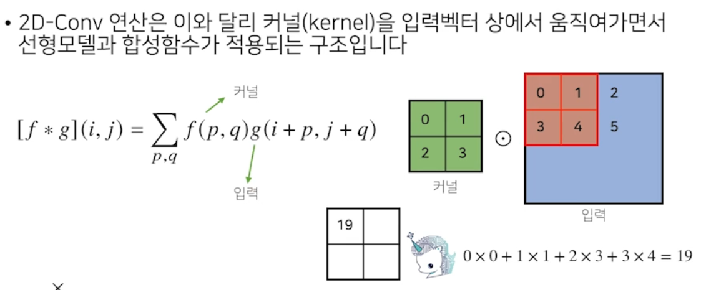
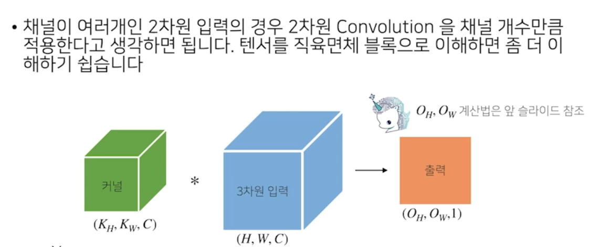
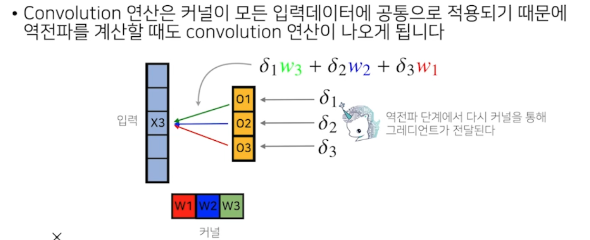
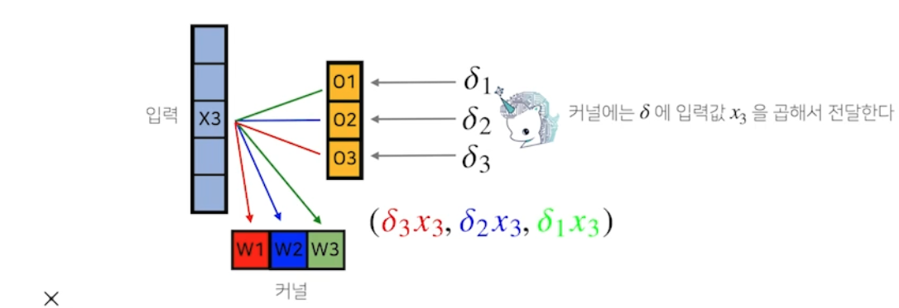
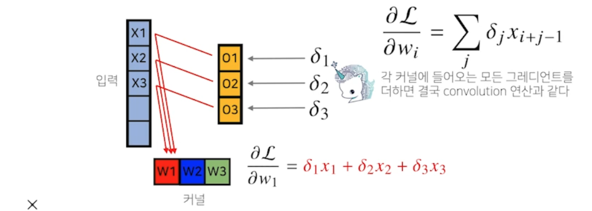

## 2차원 Convolution 연산 이해

### 연산
- 입력크기: $(H, W)$
- 커널 크기: $(K_H, K_W)$
- 출력 크기: $(O_H, O_W)$
> $O_H = H-K_H + 1$  
> $O_W = W-K_W + 1$

### 채널이 여러개일 때

- 출력 채널의 개수를 $O_C$개 만큼 만들려면 커널을 $O_C$개 만들면 됨

## convolution 연산의 역전파 이해
- convolution 연산은 커널이 모든 입력 데이터에 공통으로 적용되기 때문에 역전파를 게산할 때도 convolution 연산이 나옴  
  
$\delta$는 미분값

사진은 x3에 대한 backpropagation
 

각 커널은 각 미분값과 X3의 값을 곱해 커널에 할당
