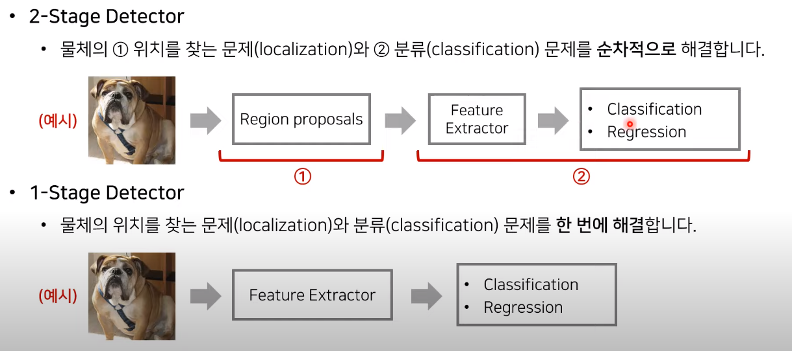
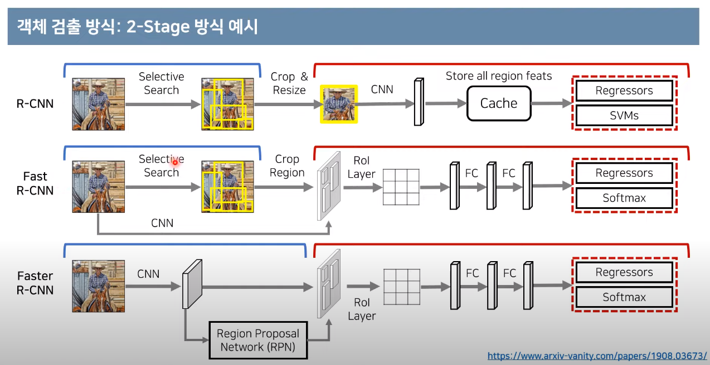
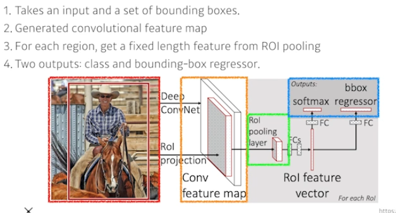
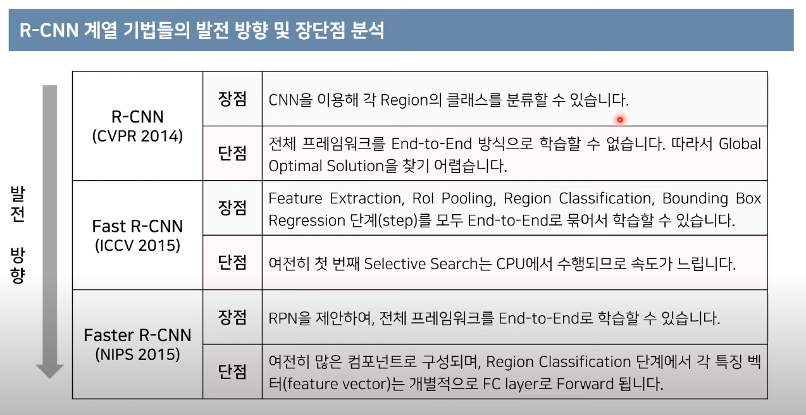
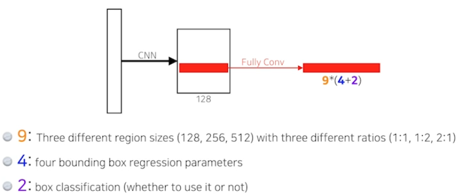

# Semantic Segmentation
## Semantic Segmentation란 무엇인가
이미지의 픽셀마다 분류해서 어떤 라벨에 속하는지 분류
> 자율주행 등에 활용

### convolutionalization
- Deconvolution
  - feature map이 줄어드는 것이 아니라 늘어난다
  - 엄밀히 말하면 역Conv는 아니지만 이렇게 생각하면 쉬움

# Detection 
바운딩 박스로 찾는 것
## object detection 방식

### 2-stage Detector
물체의 위치를 찾는 문제(localization)와 분류 문제(classification)를 순차적으로 해결
- region proposals : 이미지 안에서 사물이 존재할 것 같은 곳에 나열
- 각각의 위치에 대해 feature extractor

### 1-Stage Detector
물체의 위치를 찾는 문제(localization)와 분류 문제(classification)를 한번에 해결
- 정확도가 다소 위 방식보다 낮을 수 있음
---
### R-CNN
이미지 안에서 아주 많은 region을 뽑고 똑같은 크기에 맞춰서 SVM으로 분류를 한다 -> 그 후 CNN을 통해 feature extraction
- Selective Search를 이용해 2000개의 region proposal 생성
  - 각 region proposal을 일일이 CNN에 넣어서 결과 계산
> - 많은 region을 전부 CNN을 돌려줘야하는 문제점이 있음  
> - 입력 이미지에 대하여 CPU 기반의 Selective Search를 진행해야 하므로 많은 시간이 소요
> - end to end 방식으로 학습 불가능

### Fast R-CNN
- 동일한 region proposal을 이용하되 이미지를 한번만 CNN에 넣어 Feature map 생성
- ROI 영역에 대해 max pooling을 이용해 고정된 크기의 벡터 생성  
여러 바운딩 박스를 만든 뒤 feature map에 대응한 뒤에 뉴럴넷을 통과시킨다

### Faster R-CNN
- RPN을 통해 기존 CPU에서 진행되던 selective Search의 문제 해결(GPU상에서 돌림)
  - feature map이 인풋으로 왔을 때 물체가 있을 법한 곳에 예측할 수 있도록 함
- Region Proposal Network + Fase R-CNN

#### Region Proposal Network
- Sliding Window
  - 다양한 형태의 윈도우를 슬라이딩하며 물체의 존재 확인
  - 미리 정해놓은 바운딩박스(대충 어떤 크기의 물체들이 있을지 예상)를 k개 만들어놓고 찾는다
  - 너무 많은 영역에 대해 확인해야 한다는 단점 존재
- Selective Search
  - 인접한 영역끼리 유사성을 측정해 큰 영역으로 차례대로 통합해나감

#### NMS (Non Maximum Suppression)
- 객체 검출(object detection)에서는 하나의 인스턴스(instance)에 하나의 bounding box가 적용
  - 따라서 
### YOLO
- Region Proposal 과정이 없기 때문에 좀 더 빠름
- 동시에 작용
