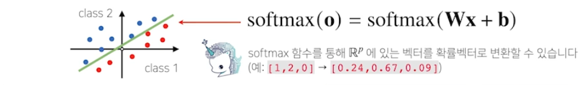
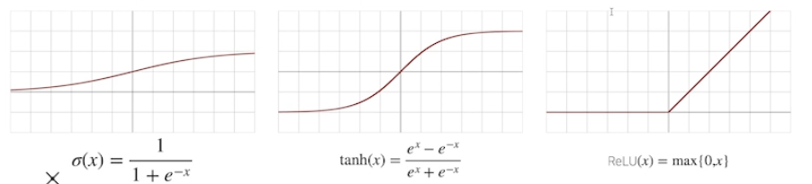
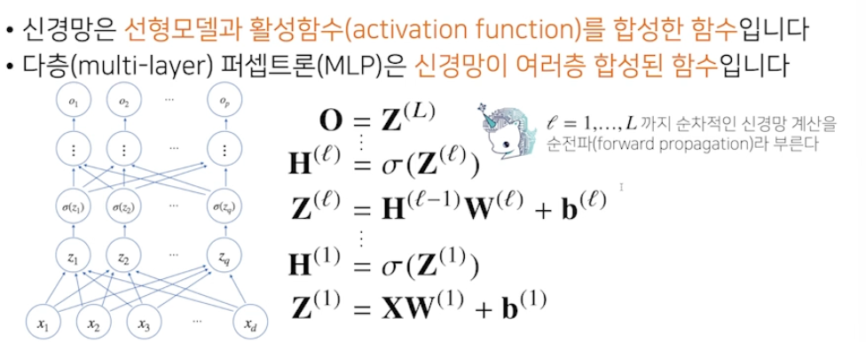
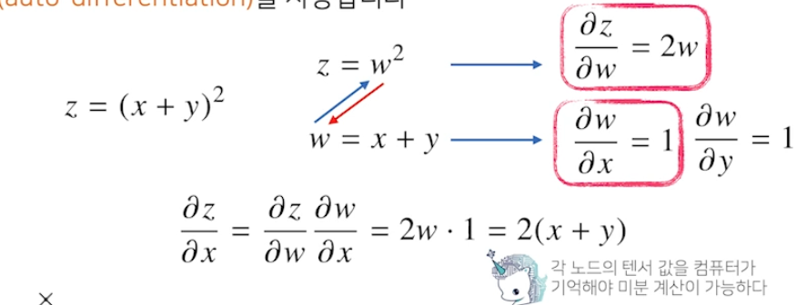
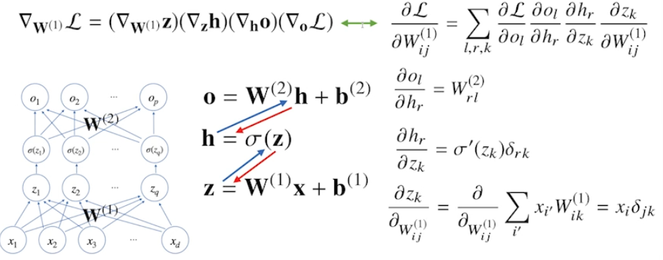

## softmax 연산
- 소프트맥스함수는 모델의 출력을 확률로 해석할 수 있게 변환해주는 연산
- 분류 문제를 풀 때 선형모델과 소프트맥스함수를 결합하여 예측

> 학습 시엔 사용하지만 추론을 할 땐 원핫만 사용 

## 활성함수
- 비선형함수로써 딥러닝에서 매우 중요
- 활성함수를 쓰지 않으면 딥러닝은 선형모형과 차이가 없음

[활성화함수 참고](https://heeya-stupidbutstudying.tistory.com/entry/ML-%ED%99%9C%EC%84%B1%ED%99%94-%ED%95%A8%EC%88%98Activation-Function)
## 신경망 계산 : forward propagation
- 학습이 아닌 계산을 의미

## 딥러닝 학습원리 : 역전파 알고리즘
- 합성함수 미분법인 연쇄법칙 기반 자동미분을 사용

## 신경망 계산 예시
