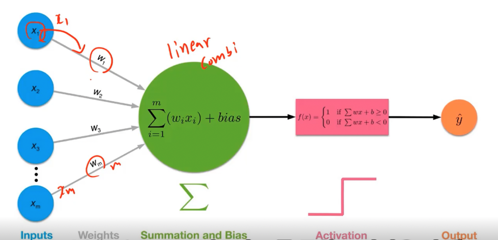

# why and what dl
50년대부터 AI, 70~80년대 ML, 80년대 처음으로 딥러닝 알고리즘이 나오며 10년대에 보편화
  
초반에는 if-else문으로 AI를 접근, but exception이 많이 발생  
-> 예전에는 모든 데이터들의 룰을 찾아서 만들면 현실 표현이 가능할 것이라 믿었음, but 불가능(사람이 모든 규칙을 찾기는 어려움)  

기존 data와 rule을 줘서 답을 찾는 형태에서 data와 answer을 주고 rules을 찾아내는 방식으로 변화  

사람이 모르는 특징 중 전체를 보고 스스로 중요한 것을 찾아낼 수 있을까라는게 딥러닝의 특징 -> 따라서 많은 data를 통해 학습한다

> 기존 ML에서는 사람이 직접 feature를 extraction했지만 DL에서는 많은 데이터셋을 주고 스스로 feature를 찾게 만듦

- AlexNet이라는 알고리즘이 나오면서 딥러닝이 많이 발달
- 많은 데이터
- GPU의 발전 (연산용 GPU)
- 오픈소스 

---
## DL
- 주로 뉴럴 네트워크 구조를 사용
- 방대한 데이터 + 높은 컴퓨터 성능 + 좋은 알고리즘

> perceptron의 구조(멀티 레이어 펄셉트론)
- activate function은 시그모이드 함수로 바꿔서 여러가지 시도

### multi layer perceptron
XOR구조도 다중 레이어로 구현이 가능한데, 과연 weight값을 어떻게 찾을 것인가?
> chain rule을 사용한 미분을 통해 Backpropagation을 이용
