# Anomaly Detection (비지도 학습)
[이상탐지참고](https://velog.io/@tobigsts1617/4%EC%A3%BC%EC%B0%A8-Anomaly-Detection-Clusturing-PCA)
- 주어진 데이터로부터 대세 경향이나 분포를 따르지않는 이상객체를 탐지하는 문제
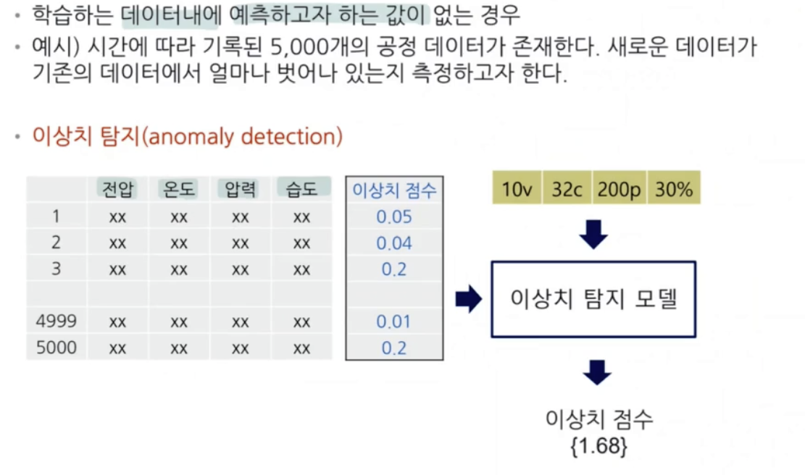

## 단일 변수의 이상치 탐지
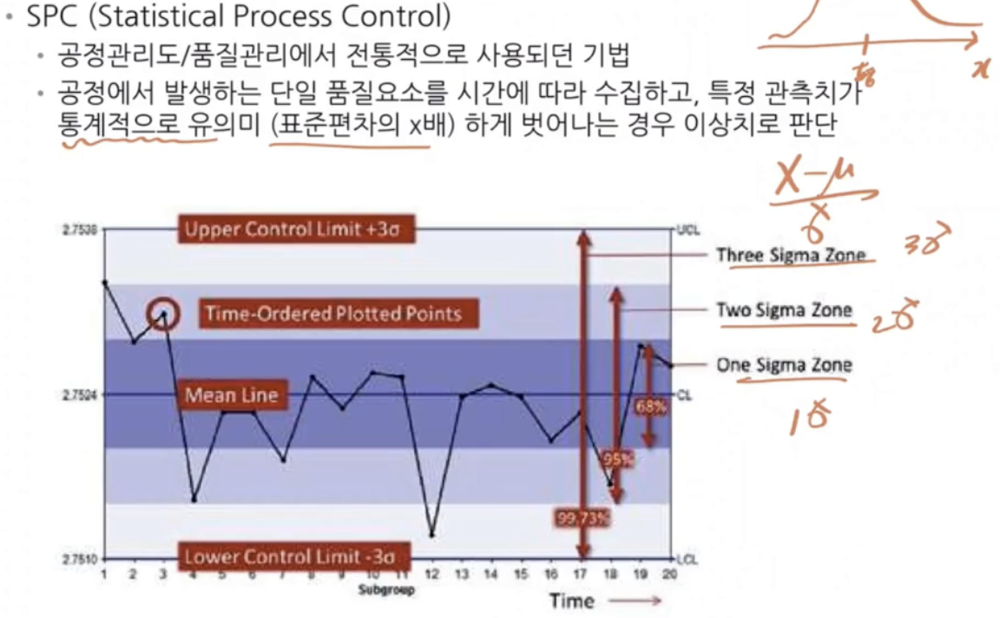
- 평소에 배우는 일반적인 공정에서 통계적 탐지

## 다중 특성 (변수가 여러 개일 경우)
- 단읿 변수에서는 이상치가 아니지만 여러 변수의 종합하여 판단하였을 때 이상치인 경우 발생

## 이상탐지 방법론 - 학습
- (가정) 주어진 데이터는 모두 정상이다
- (학습) 정상 데이터의 분포/패턴을 설명하는 모형학습
  - One-class classification
- (판단)
  - 학습된 모형이 설명하지 못하는 객체를 이상으로 판단
  - 이상치로 판단된 데이터에 대해 추가분석 수행

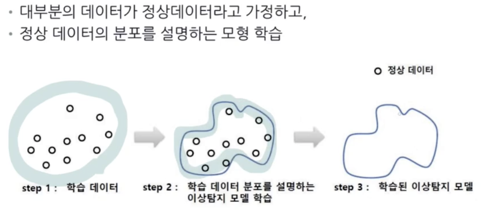
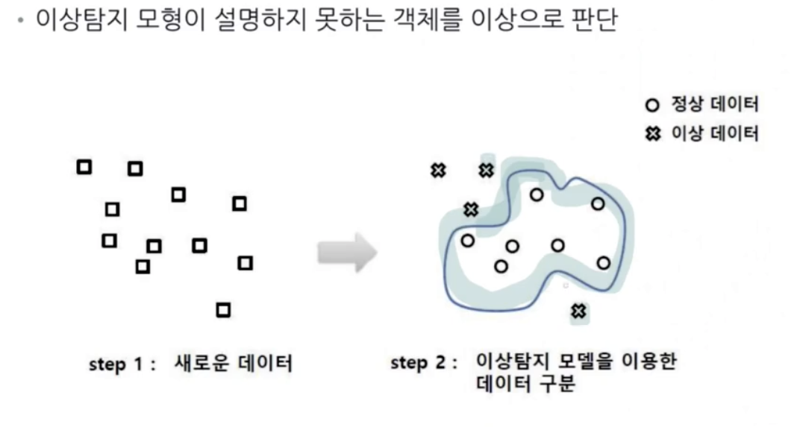

---
## KNN을 이용한 이상탐지
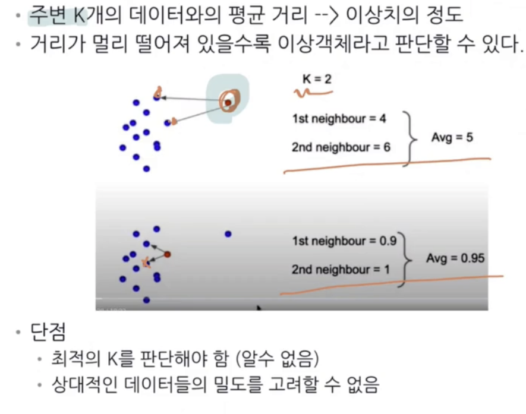
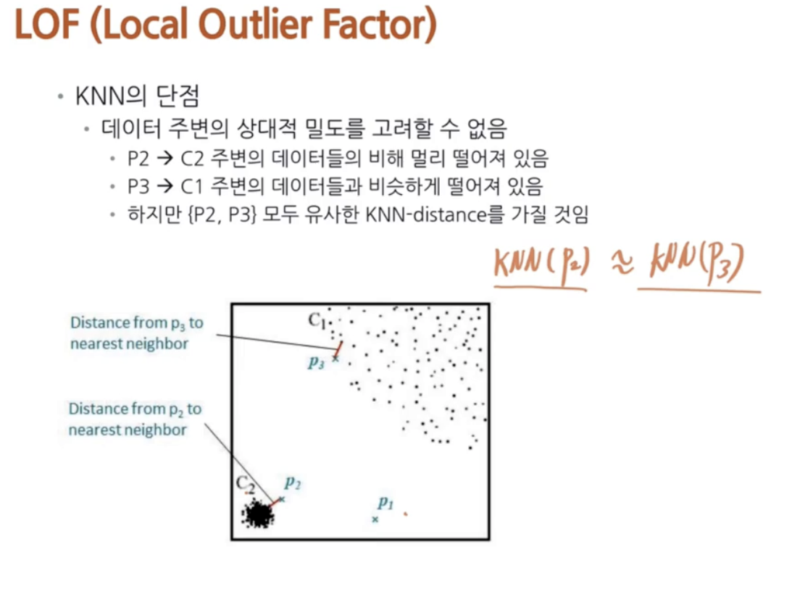
> 주변의 상대적인 밀도를 계산하자!
---
## LOF (Local Outlier Factor) - K-distance
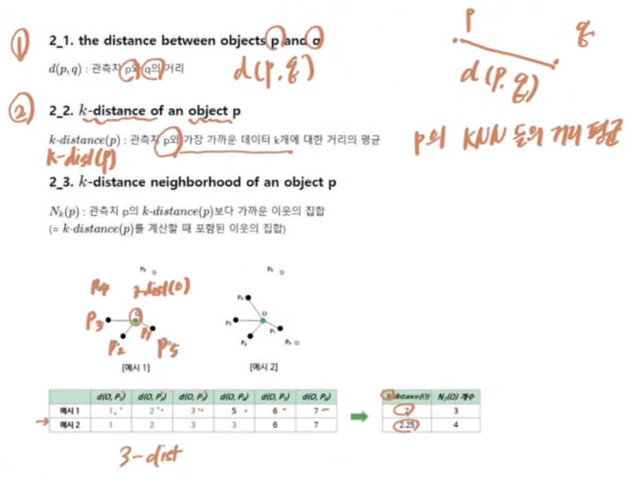
> 괄호 안에 있는 걸로 해석 윗 줄 무시
- 예시1 : 3일 때의 평균거리
- 예시2 : 3일 때 거리가 같은 것이 있으면 그것도 포함
- `k-dist(p)` : p를 기준으로 나와 가까운 K개의 평균거리
- $N_k(p)$ : k-dist(p)안에 들어오는 점의 개수

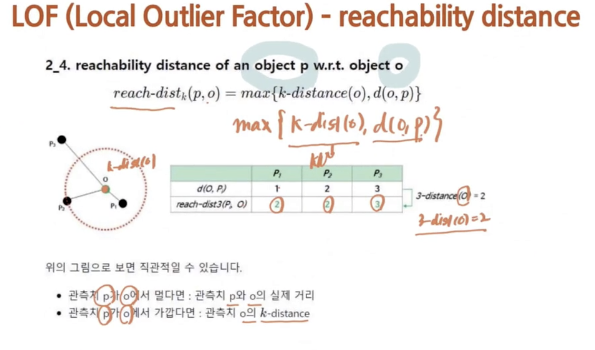
- $reach-dist_k(p, o) = max{(k-distance(o), d(o,p))}$
- d(O,P)가 k-distance(o)보다 가까워도 max에 의해서 큰 값 선정
- 멀면 큰 값 선택

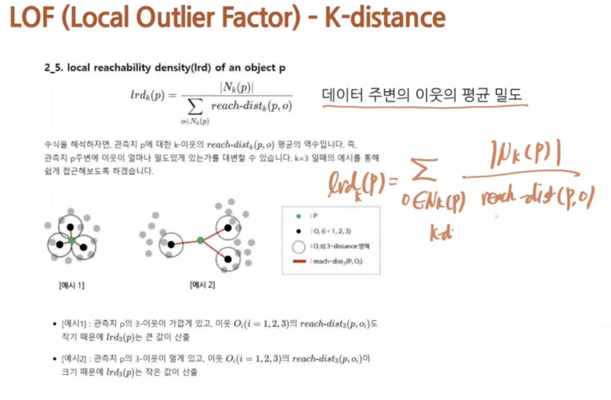
- p라고 하는 점 주위의 밀도
- $lrd_k(p)$ 는 쉽게 생각하면 내 점을 기준으로 했을 때 밀도
- $LOF_k(p)$ 내 주변 점들의 평균밀도 대비해서 내가 어느정도 밀도인가 (작으면 정상, 크면 이상치-다른 친구들에 비해 밀도가 작다)

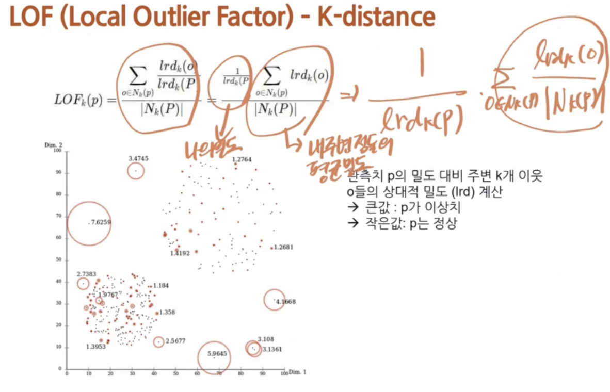

---
## Gaussian Mixture Model
SKip

---
## PCA를 이용한 이상치 탐지
- 주성분이 데이터의 패턴을 잘 설명한다고 했을 떄,
- 실제 데이터와 PCA 사용 후 복구했을 때 차이가 큰 데이터는 정상분포를 따르지 않는 데이터라고 생각할 수 있음
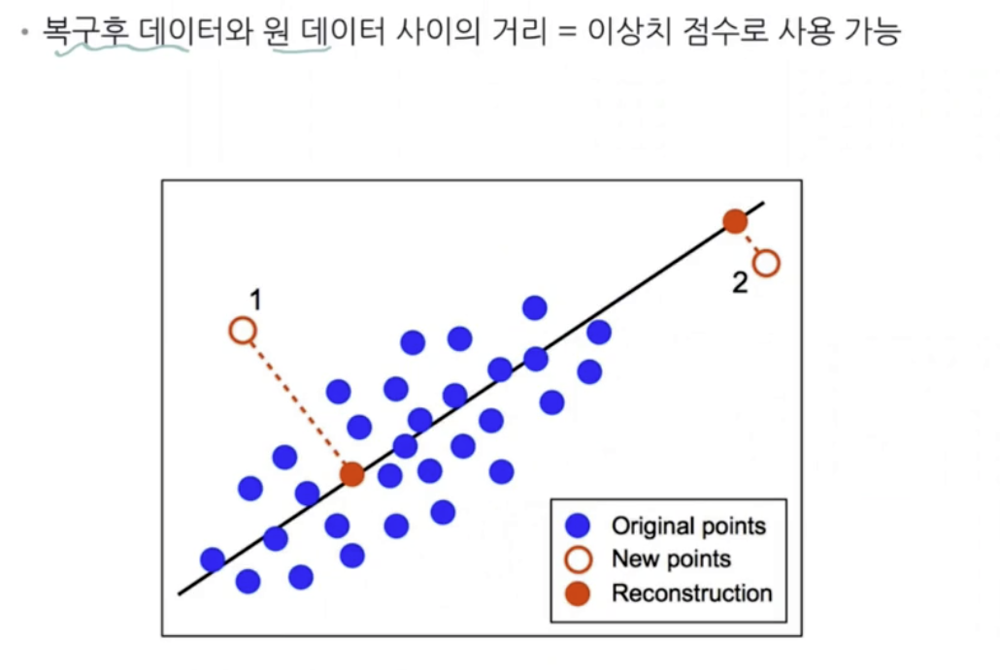
> 기존에 사영했던 것을 다시 복원을 수행하여 기존의 값과 차이가 많이 나면 이상치일 확률이 높은 것으로 간주

---
## Isolation Forest
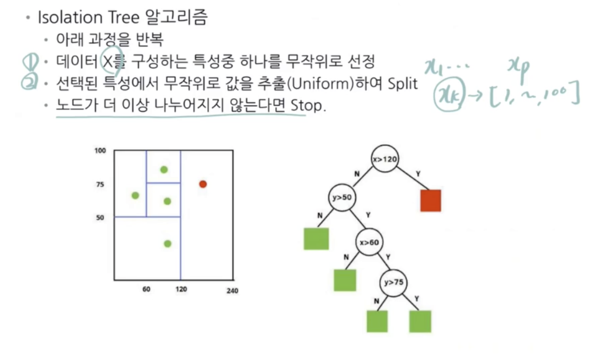
- 정상 데이터가 고립되려면 많은 수의 질문을 거쳐야 함(depth가 커짐)
- 비정상데이터는 적은 수의 질문으로 고립 가능(depth가 낮음)

$s(x,n)=2^{-\frac{E(h(x))}{c(n)}}$

---
## 이상치 탐지 모형의 평가방법
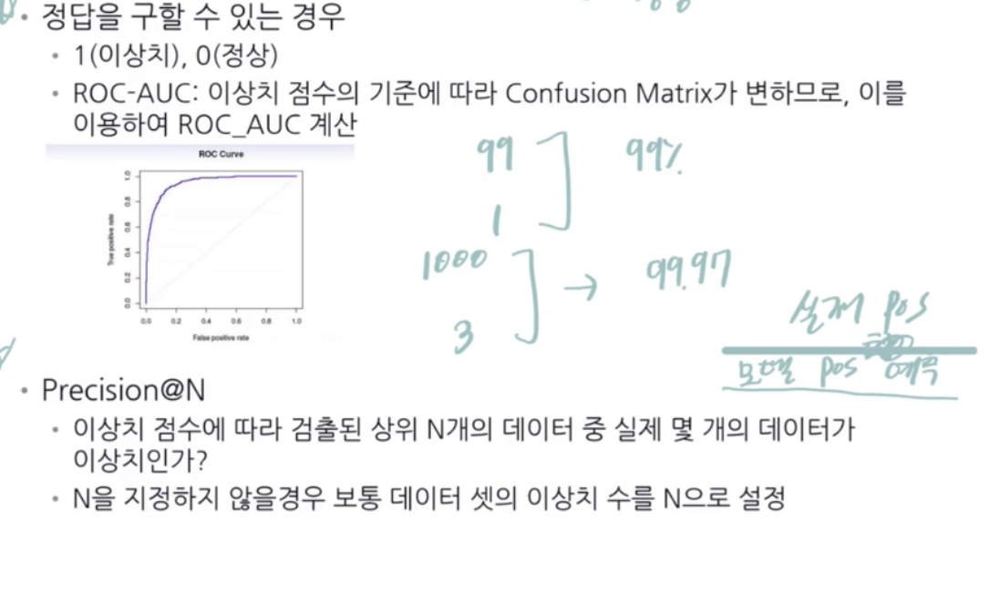
> accuracy를 그냥 쓰면 안 된다 -> 다 정상이라고만 해도 높은 accuracy가 나올 수 있음

## 분류와 이상탐지문제의 구분
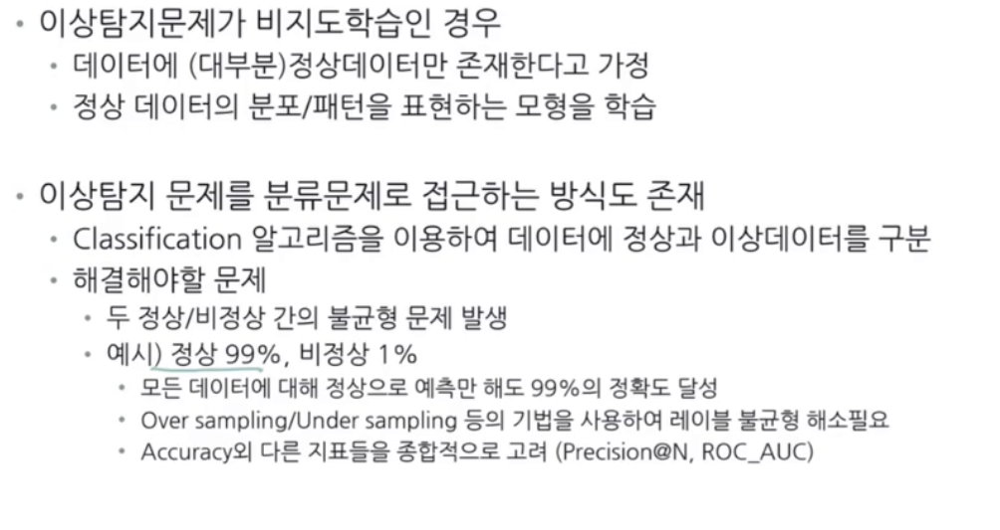

## 이상치 탐지 모형의 평가방법
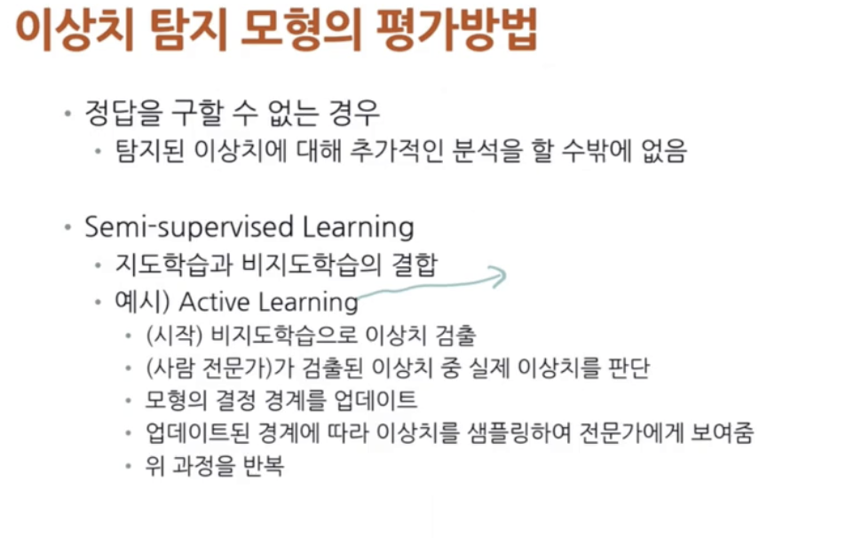

## 이상치 탐지의 응용분야
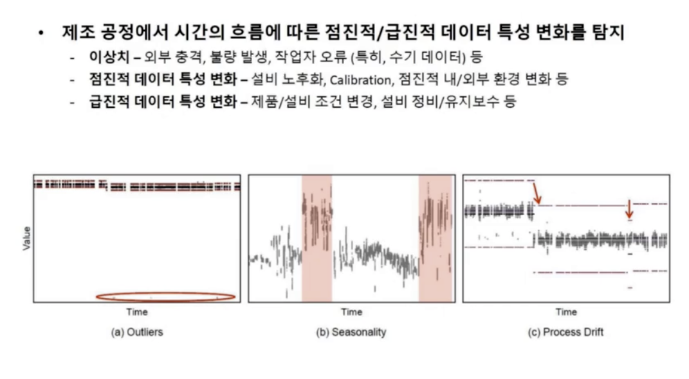
