# Clustering Analysis
- 서로 유사한 데이터 객체들끼리 묶어 군집을 만드는 기법
- 비지도 학습

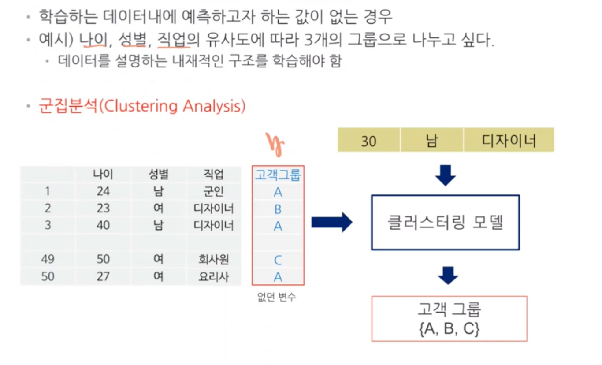

## 데이터 객체간의 유사도 측정
- 유클리디안 거리
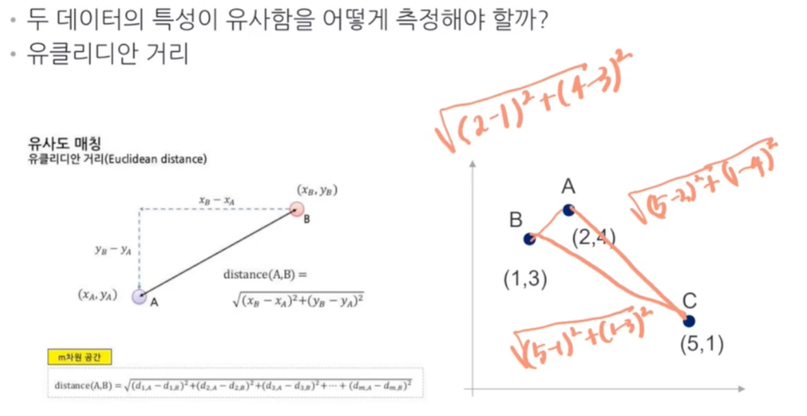
---
## K-means 클러스터링
- 주어진 데이터를 개의 클러스터로 묶는 알고리즘
- 정해진 중점을 기준으로 가까운 점들을 묶는 과정을 반복하여 군집 파악

## K-means 클러스터링 알고리즘

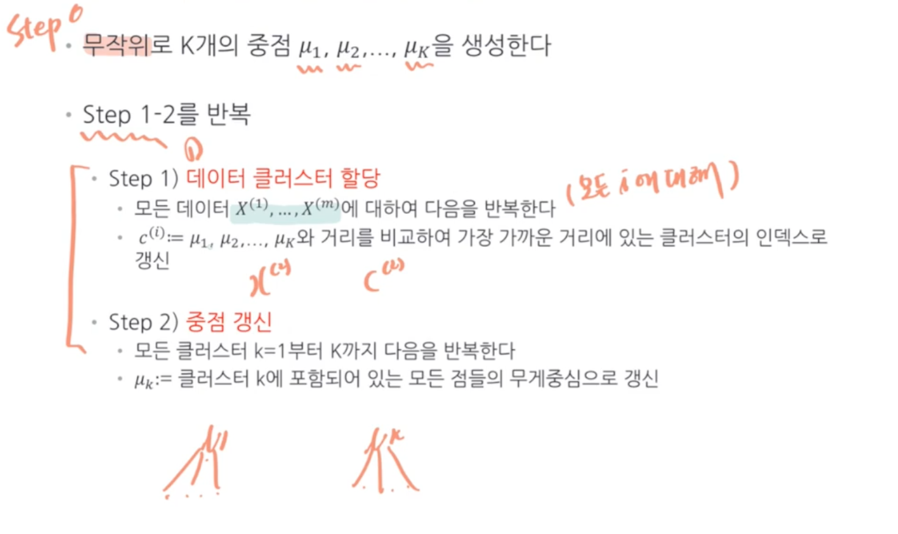
- 각각의 데이터를 $\mu_k$와 비교하여 가장 가까운 $\mu_k$에 할당시킴
- 그 뒤 $\mu_k$ 는 클러스터 k에 포함되어 있는 모든 점들의 무게중심으로 갱신

## 과정  예시
step 1. 무작위의 K개 중점 생성 후 데이터를 가까운 $\mu_k$에 할당
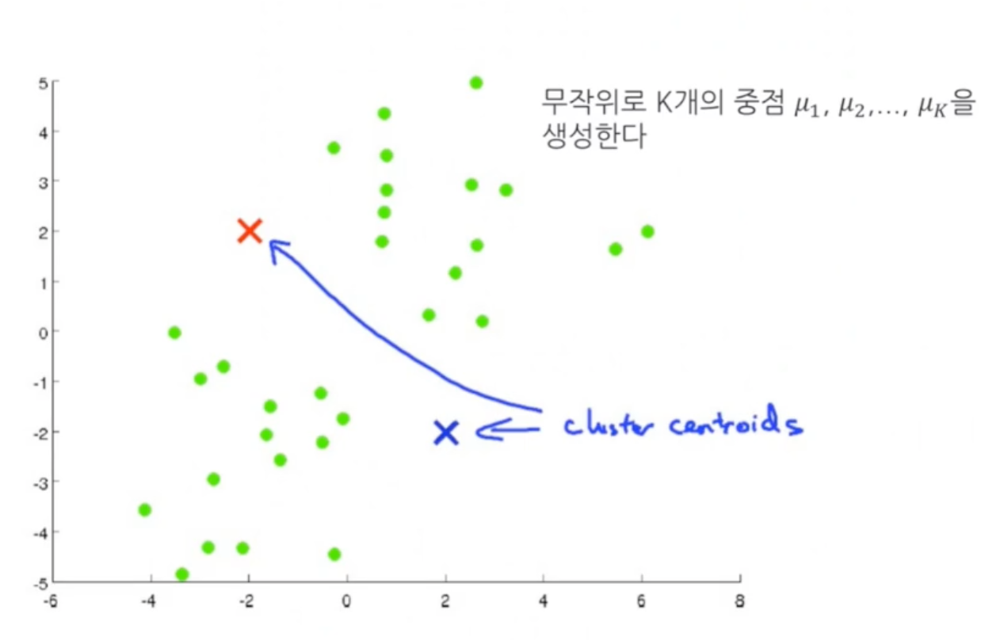
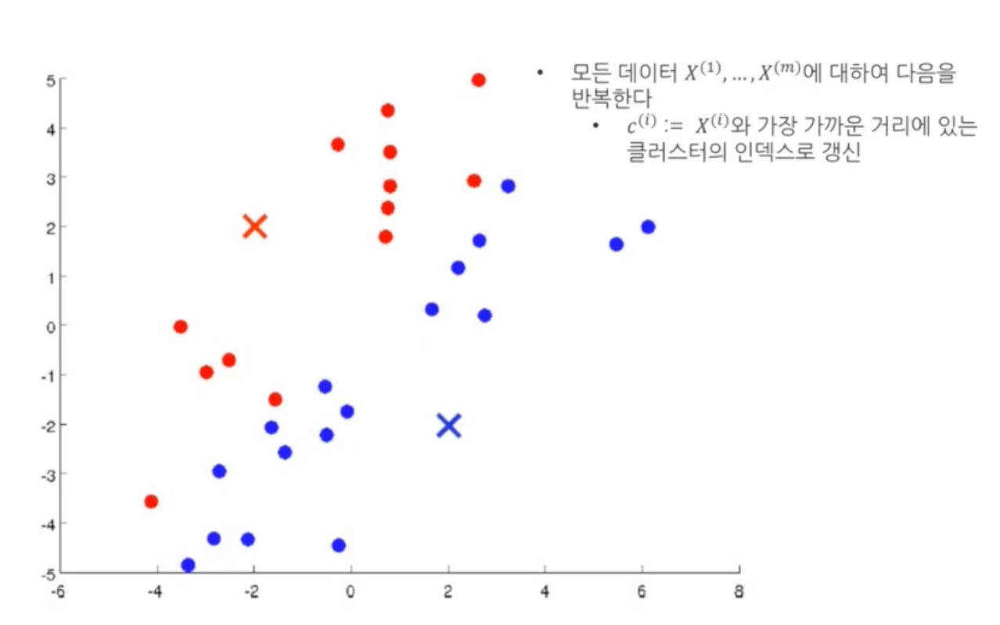

stpe 2. 클러스터링된 군집의 무게중심(평균값)을 계산 해 $\mu_k$ 갱신 후 거리 재서 클러스터 재할당 -> 다시 무게중심 구하고 거리 재서 클러스터 재할당하는 과정을 반복하다가 더 이상 갱신되는 지점이 없으면 종료
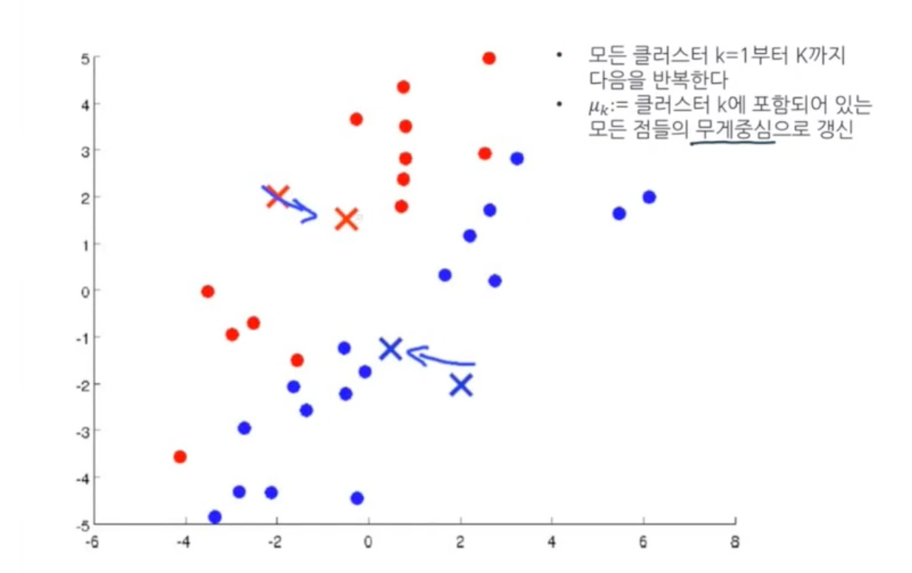

## 클러스터링 분석의 평가
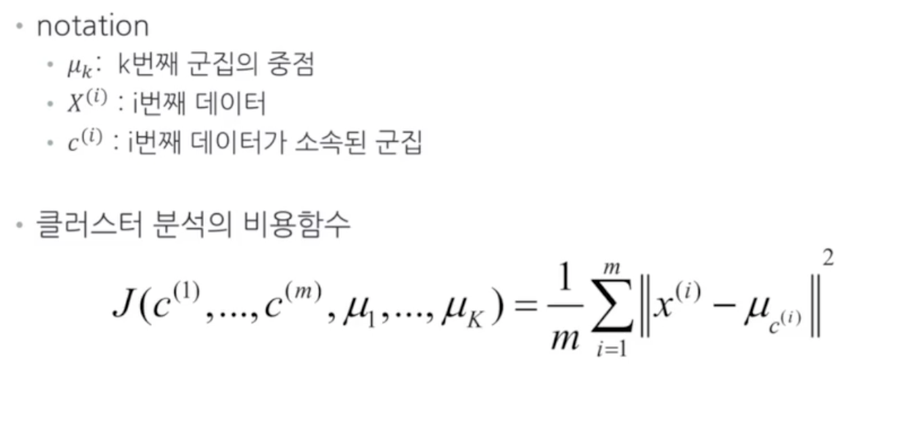
- $\mu_{c^i}$ : i번째 데이터가 소속된 군집의 중점
> 각각의 데이터와 해당 데이터의 군집 중점과의 거리가 최소가 되게 해야한다

## K-means 알고리즘의 약점
- 클러스터 분석의 성능은 무작위로 생성된 첫 클러스터 중점에 크게 영향을 받는다
- Local Optimal이 생길 수 있음

## K-means의 약점을 극복하기 위한 방법
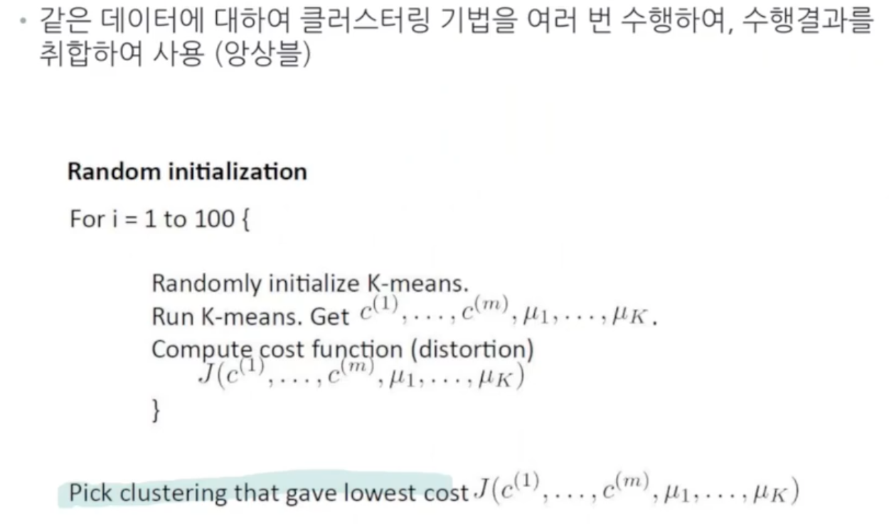
- 가장 낮은 value function을 선택
## K-means 하이퍼 패러미터 조정
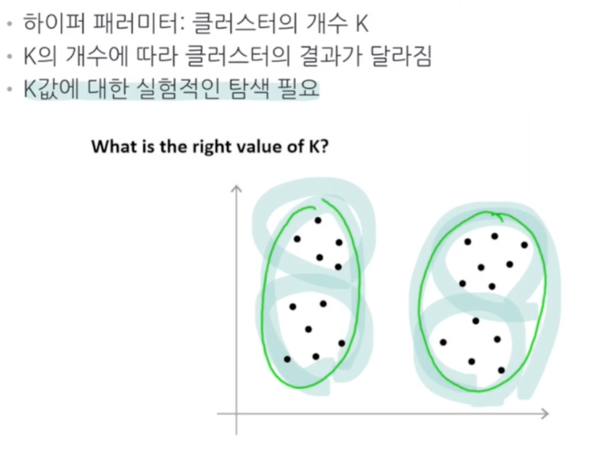

## 하이퍼 패러미터 선택방법
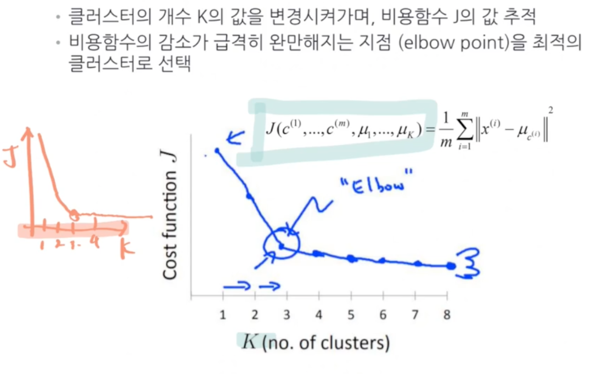
OR
- 도메인 지식에 의존 (ex - 의류 분류의 경우 사이즈 별로 S, M, L과 같이 3개로 지정 후 학습)

## K-means 클러스터링 장단점
### 장점
- 구현이 간단
- 계산량이 적음

### 단점
- 하이퍼 패러미터 튜닝 필요
- 초기 랜덤하게 생성된 중점에 영향을 받음
- 데이터의 스케일에 민감 -> 거리 계산전 표준화 등의 전처리 필요

---
## 계층적 클러스터링 (Hierarchical Clustering)
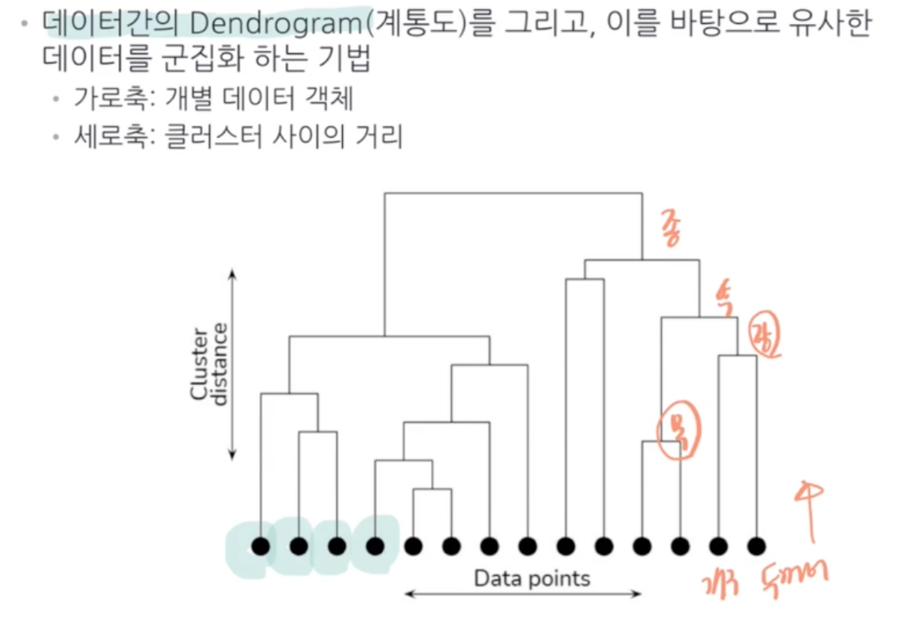

## 계층적 클러스터링 알고리즘
- 개별 데이터 객체를 각각의 그룹(클러스터로 지정)
- (다음을 반복)
  - 가장 가까운 두 개의 클러스터를 찾아 합침
  - 만약 모든 데이터가 하나의 클러스터로 합쳐지면 종료

  
  
  
  
- 그림에서 선의 높이가 클러스터 간의 거리

## 클러스터간 거리 계산 방식
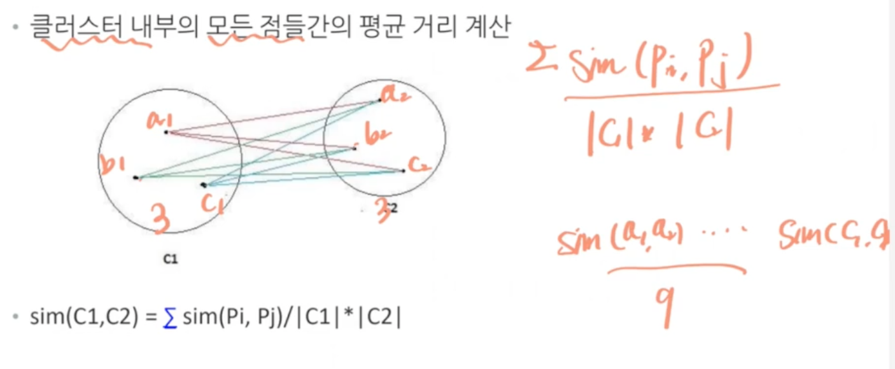
- 각 군집들 간에 평균 거리가 나온다
- 이를 통해 계통도 그림

## 계통도에서 클러스터 탐지
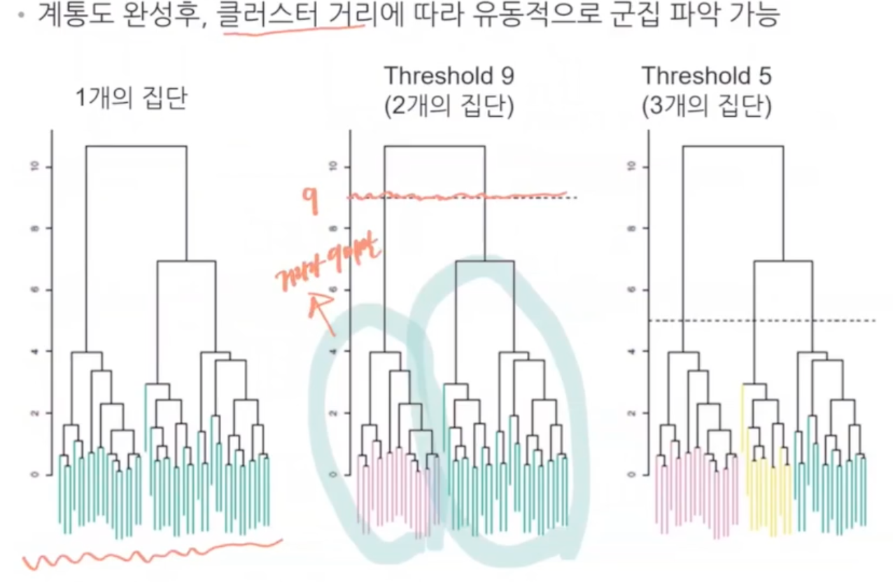

## 계층적 클러스터링 (장단점)
### 장점
- 하이퍼패러미터 필요없음
- 데이터들간의 관계에 대한 시각화가 가능

### 단점
- K-means에 비해 계산이 복잡(큰 규모의 데이터에 적합하지 않음
  - why? 
- 데이터 스케일에 민감 -> 표준화 등의 전처리 필요
- 데이터 수가 많아지면, 적절한 클러스터 기준을 찾는데 어려움 존재
---
## 클러스터링 이슈

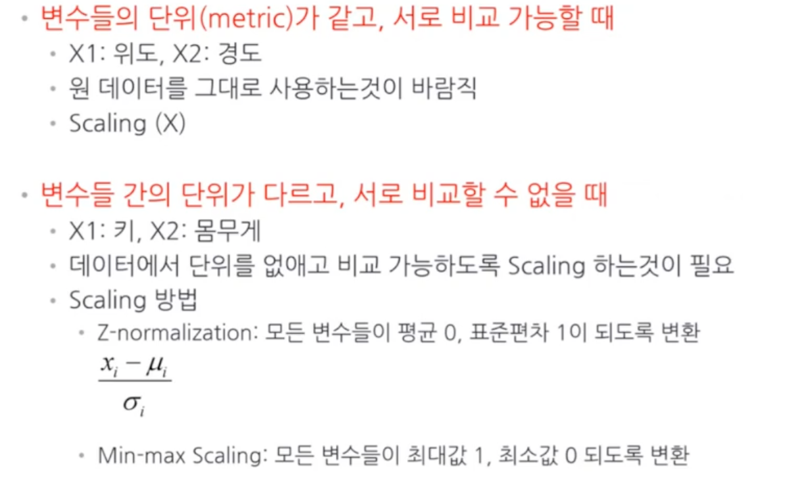

## PCA + Clustering
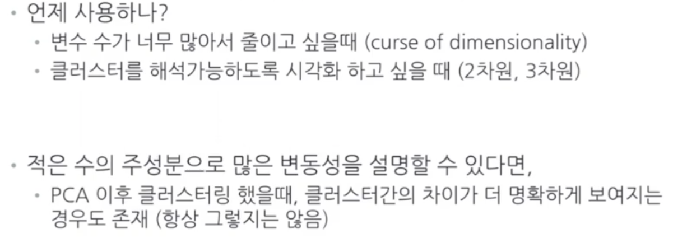
