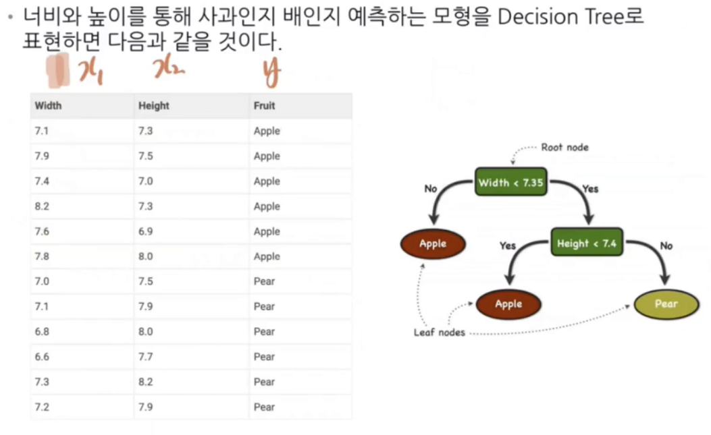
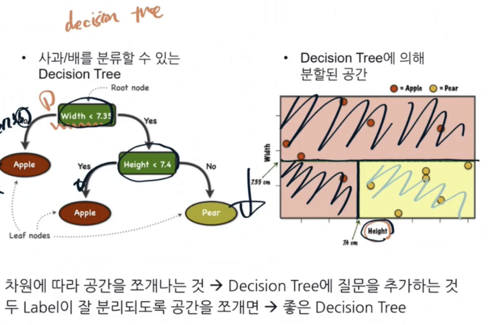
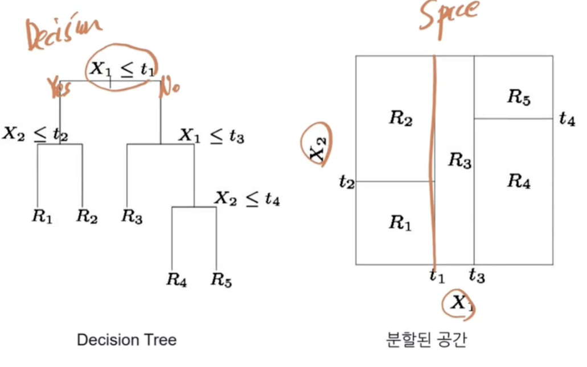
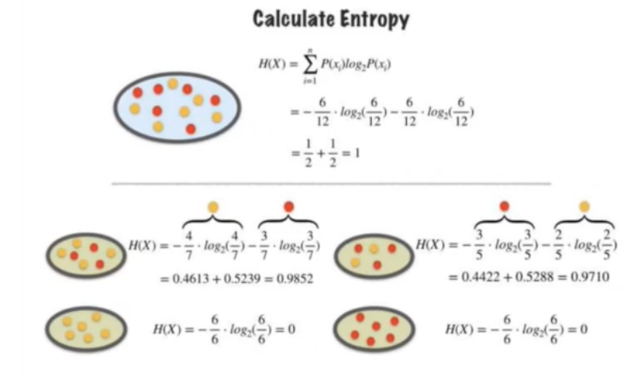
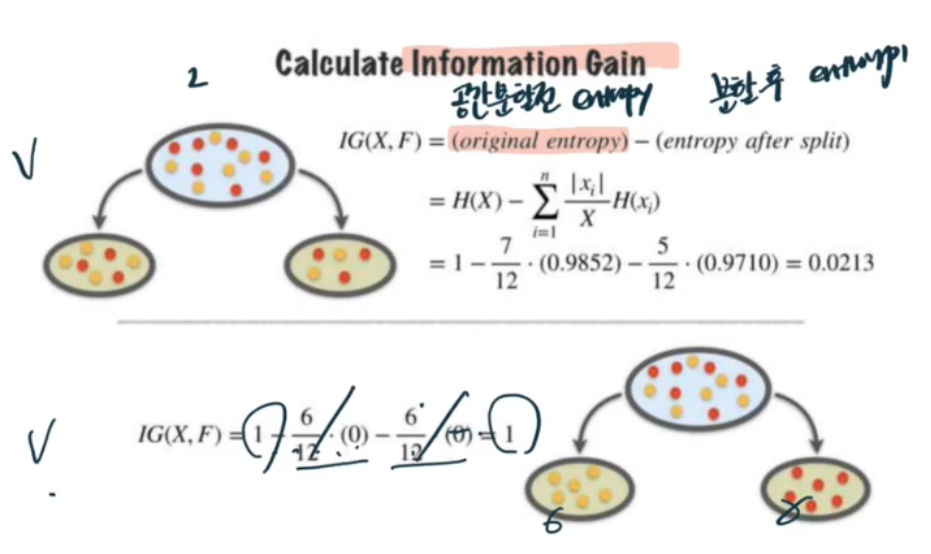
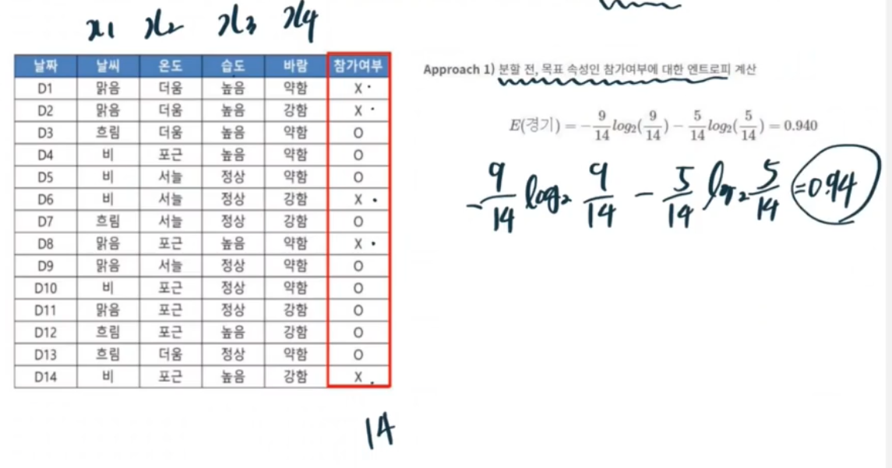
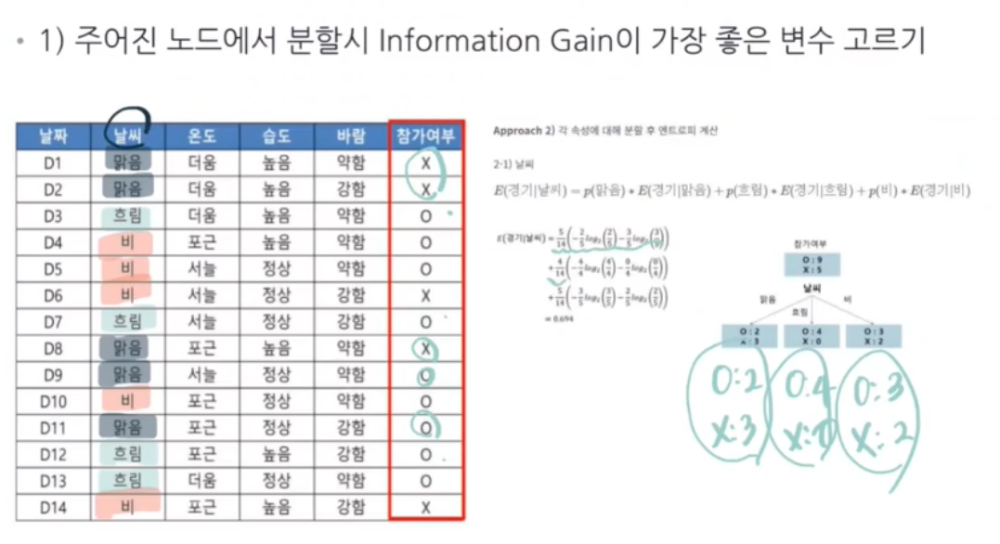
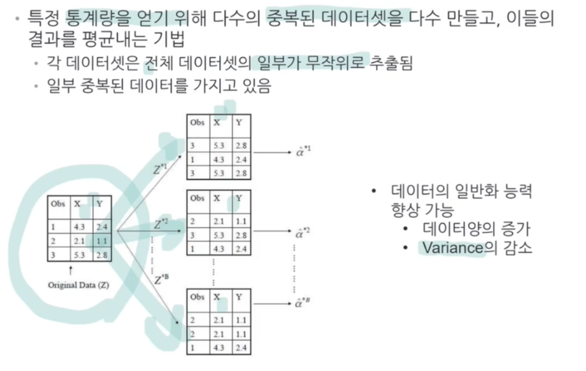
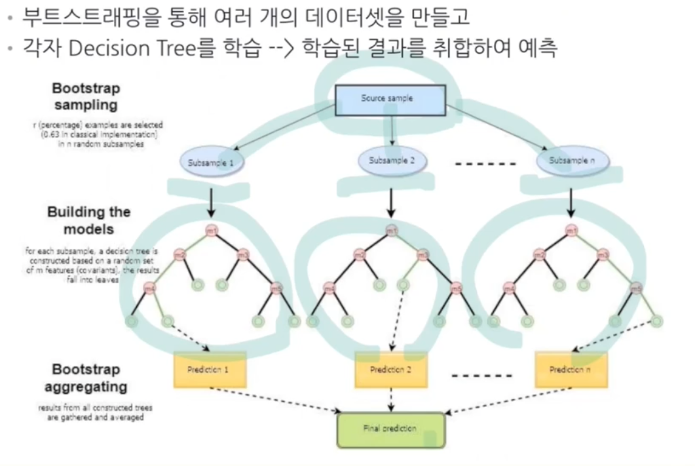

# Decision Tree
## 데이터로부터 Decision Tree 만들기
- root node, leaf node로 구성

## Decision Tree의 원리 및 공간의 분할

- split의 결과로 두 Class가 깨끗하게 나눠질수록 좋은 분할

## 엔트로피란?
- 무질서함의 정도를 측정하는 지표 -> 1에 가까울수록 무질서 (두 label이 많이 섞일수록 무질서함이 큼)  
$H(X)=-{\sum_{i=1}^{n}}P(x_i)log_2P(x_i)$
](https://raw.githubusercontent.com/jsw6872/DataScience-ML-Spring/main/data_science-spring/img/entropy.png)

## Information Gain
- 공간을 쪼갬으로 인해서 얻어지는 엔트로피의 감소 정도

> 쪼개진 공간에서 각각 H(X)를 구해서 IG(X, F)를 구한다

## Decision Tree Algorithm (ID3)
1.  주어진 노드에서 분할 시 Information Gain이 가장 좋은 변수 고름
2.  위 단계에서 얻어진 자식 노드 각각에 대해 다음을 실행
    1. If 자식 노드가 pure 하다면 -> 알고리즘 종료
    2. Else 자식 노드에 대해 위 알고리즘을 똑같이 적용 (재귀적 알고리즘)

## ID3 알고리즘
1. 분할 전, 목표 속성인 종속변수에 대한 엔트로피 계산  
ex) 아래는 참가여부가 종속변수

2. 주어진 노드에서 분할시 Information Gain이 가장 좋은 변수 고르기  
ex) 아래는 날씨를 기준으로

3. 각 속성에 대해 종속변수에 대한 엔트로피와의 차가 가장 큰 것을 먼저 분류

> 흐림의 경우 pure하기 때문에 종료 나머지는 재귀적으로 다시 반복  
> 맑음과 더움에 대해 온도, 습도, 바람으로 각각 다시 Information Gain구해서 반복

## 변수가 연속형일 때 변수 선택 방법
- 변수 선택
  - 변수에 따라 데이터를 정렬
  - 변수가 가질 수 있는 값을 하나씩 넣어보면서 계산

Method 1. 각 데이터들 사이의 중앙값을 기준으로 나눔  
Method 2. 종속변수(label)가 바뀌는 지점에서의 중앙값으로 나눔  
Method 3. 4분위 기준으로 쪼갬

## Decision Tree의 오버피팅
- Tree의 깊이가 깊을수록 개별적 데이터를 잘 분류할 수 있음 (Flexible)
  - 너무 깊으면 Overfitting 발생 가능성 증가 

## Decision Tree Hyper parameter
- 트리의 최대 깊이 (Max Depth)
- Minimum number of samples to split (쪼개기 전)
  - Split을 멈추는 노드 안의 최소 데이터 개수
  - ex) 11이면 노드 안에 11이 될 때 split을 멈춤
  - 작을수록 유연한 모델이 된다
- Minimum number of samples per leaf (쪼개고 난 후)
  - 쪼갰을 때 샘플의 수가 n개가 돼어야함
  - ex) 5일 때 leaf 안에 데이터가 5개가 되어야 멈춤
  - 작을수록 비대칭성이 강화된다

## Decision Tree의 장단점
### 장점
- 분류예측에 유용 (회귀도 가능)
- 연속, 범주형 모두 취급 가능
- 변수의 중요도 비교 가능
- 비교적 빠른 속도
### 단점
- 연속형 변수값 예를 들어 회귀에서 적당하지 않음
- 복잡한 모형일수록 해석 및 예측력이 떨어짐
- 데이터 변형에 민감하여 안정적이지 않음(오버피팅 발생이 쉬움)

## 부트스트래핑

## DT 단점 극복을 위한 랜덤 포레스트
- 부트스트래핑을 통해 여러 개의 데이터셋을 만들고 각자 DT 학습-> 학습된 결과를 취합하여 예측

## random forest 장단점
### 장점
- 일반화 능력과 예측력이 좋음
- 중간 사이즈의 데이터에서 매우 많이 사용되는 기법
### 딘점
- 여러 개의 Decision Tree가 중첩되어 있으므로 설명하기가 어려움
- 단일 트리에 비해 많은 계산 시간 소요
