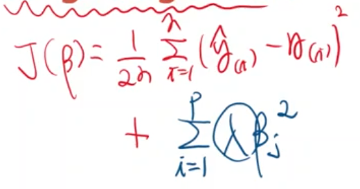
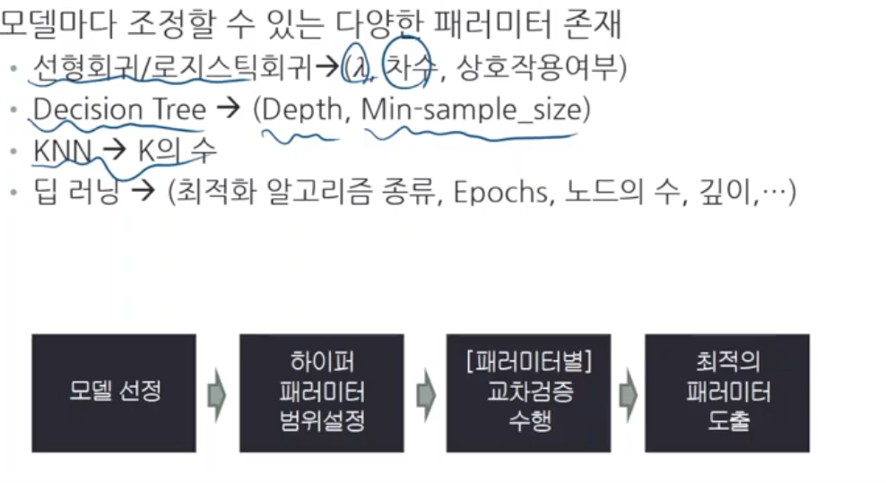

# 하이퍼 패러미터 
- 모델의 일반화 능력은 모델의 유연성과 깊은 관련성이 있음

## what is hyper parameter
- 모델의 유연성을 조정하는데 사용하는 parameter
- `학습 시작되기 전` 지정 됨
- `사용자`가 사전적으로 지정하며 데이터로부터 학습되지 않음
* * 기존 parameter 는 데이터로부터 학습됨
* 하이퍼 패러미터에 따라 각각은 서로 다른 가설이 됨 (서로 다른 모형)
  * ex) hp : k = 1, k = 2, ....
  * $$ \lambda : 1, 100, 1000...$$ 
---
## hyper parameter tunning
- 하이퍼 패러미터의 조정을 통해 보다 정확한 모델을 찾아나기 위한 절차
- hypter parameter + cross validation
1. 모델 선정
2. 하이퍼 패러미터 범위 설정
3. 하이퍼 패러미터별 교차검증 수행 (하이퍼패러미터가 긱긱이 하나의 모델이 된다)
4. 최적의 하이퍼 패러미터 도출

---
## 모델 규제 (model regularization)
`학습`이란 최소의 비용함수를 찾는 과정  
하이퍼 패러미터 k를 유지하면서 모델의 유연성을 조절할 수 있는가?  
-> 가능  
HOW?
- ex) k= 4 지만 3차 weight과 4차 weight에 매우 큰 계수를 주고 비용함수에 더한 것을 새로운 비용함수로 정의함으로써 최적의 비용함수를 구했을 때 3,4차 weight이 거의 0이 되게 함으로써 k = 2인 것처럼 해서 과적합을 방지한다.
- 람다가 커지면 강력한 규제(매우 큰 계수)

## 모델 규제를 위한 비용함수 : Ridge Regression
  
p는 feature 수
---
## 하이퍼패러미터
- 모델의 유연성을 조정하는데 사용하는 패러미터
- 학습 시작되기 전 지정됨
- 사용자가 사전적으로 지정하며 데이터로부터 학습되지 않음

- K : 다항식 차수
- $$ \lambda : 모델규제 비용함수의 계수 $$
- 변수간 상호작용 삽입 여부

