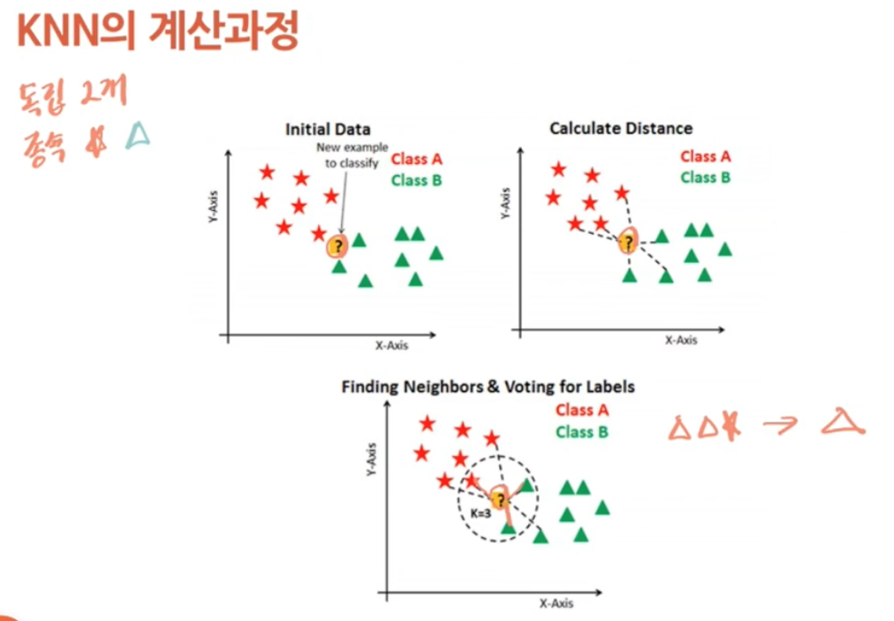
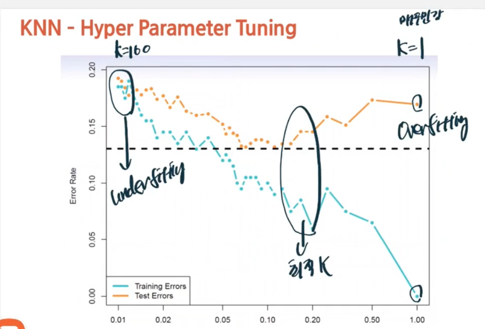
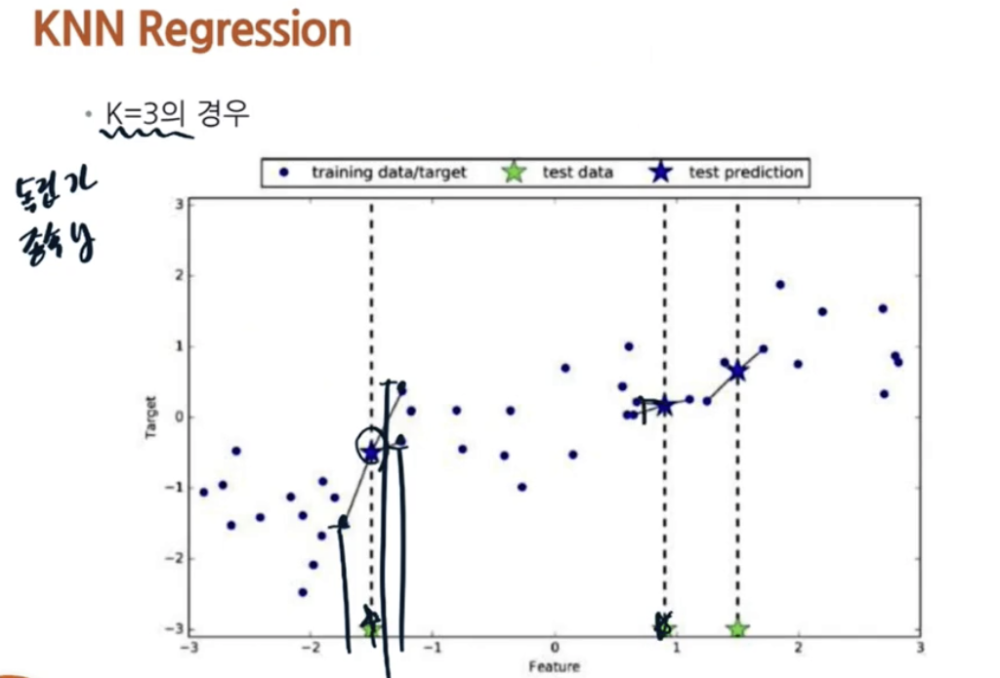
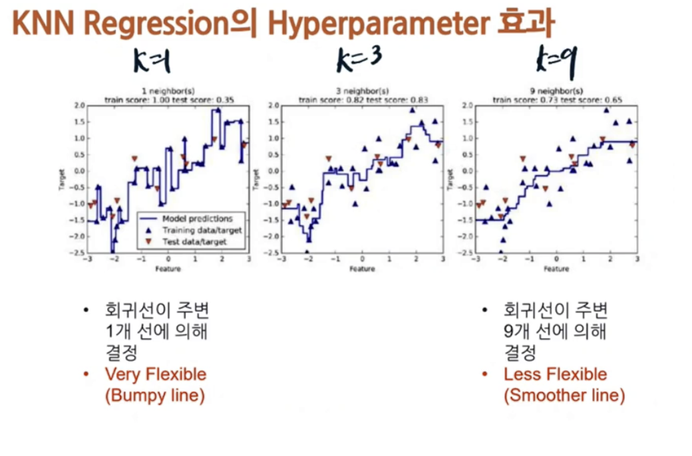
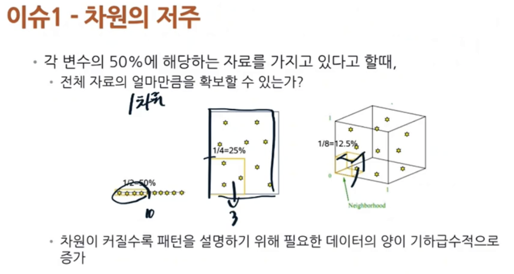
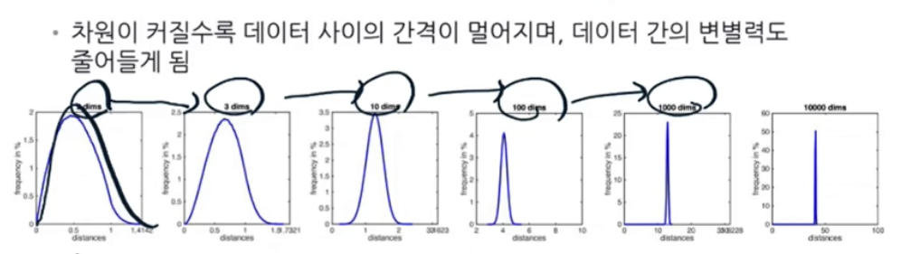
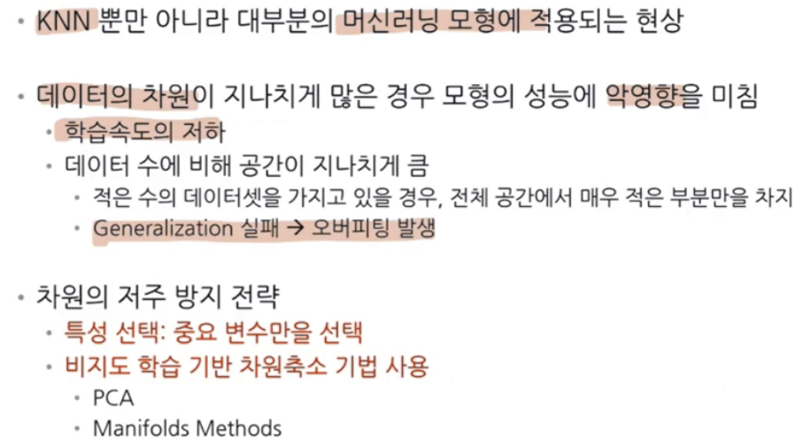

# KNN 모형
## 선형회귀모형의 한계점
- 분류의 경우 데이터가 섞여 있을 때 차수를 높이면 분류는 잘하지만 좋은 모형이라 볼 수 없음
- 회귀의 경우도 복잡한 데이터일 경우 낮은 차수로 표현이 힘듦
- complex, non-linear
> KNN 모델로 극복 (Non-parametric Method)

## KNN이란
- K Nearest Neighborhood ( K개의 가장 가까운 이웃 )

## KNN - Algorithm
1. 얘측하고자 하는 데이터 x와 내가 확보한 N개의 데이터 사이의 거리를 구함
2. 위 결과를 정렬하여 x와 가장 가까운 거리의 k개 데이터를 찾음  
3. 분류) x와 근접한 k개의 데이터의 Label들 중 가장 많은 Label로 예측  
회귀) x와 근접한 K개의 데이터의 Label의 평균값

## 데이터 간의 유사성 측정을 위한 거리 측정
- 유클리디이안 거리 이용  
$\sqrt{(x_B - x_A)^2+(y_B - y_A)^2}$

## KNN의 계산 과정

예측하려는 값과 데이터들 간의 거리 측정후 가까운 k개의 데이터를 뽑아서 분류

## KNN의 하이퍼 패러미터 k 정의
- 하이퍼패러미터
  - 모델 학습 전 사전에 정의하는 parameter
  - KNN에서 예측할 때 참조하는 이웃의 개수 K가 하이퍼 parameter
- 분류문제에서 KNN의 경계선은 k의 영향을 받는다

## KNN - Hyper Parameter
- k가 클수록 경계선이 주변 점에 둔감
- k가 작을수록 경계선이 주변 점에 민감

## 선형모델에서의 KNN (KNN Regression)

- 분류와 마찬가지로 feature의 값을 주변 가까운 k개의 데이터의 평균으로 prediction 한다

## KNN Regression hyperparameter

## KNN 장점과 단점
### 장점
- 예측이 주변 데이터에 의해 결정되므로 모형의 학습이 필요 없음
- 데이터 구조에 대한 사전 지식이 필요없음 (주변 k개의 데이터만 보면 되므로)
- 하이퍼 패러미터 단순, 생각보다 성능이 좋은 경우 존재

### 단점
- 데이터 특성의 수가 커지면 성능 저하  -> 차원의 저주
- 데이터의 스케일링 필요 (데이터의 단위 통일 필요)
- 데이터 수의 영향을 받음 (거리 연산 수가 늘어나므로 시간 오래 걸림 - 모든 데이터간의 거리를 계산해야하기 때문에)

## 이슈1 : 차원의 저주

- 데이터 간의 의미가 무의미해짐(개수가 많아지면 데이터들 간에 거리가 거기서 거기)

- 일반화 실패 -> 오버피팅 발생 (확보한 데이터가 너무 작아서 일반화할 수 없지만 이 적은 데이터를 너무 설명을 잘 하기 때문에 일반화 하기 어려움)

## 이슈2 : 변수의 Scailing
- 서로 다른 단위들로 유클리안거리를 하면 큰 숫자를 가진 단위에 의해 값이 많이 영향을 받음
  - 따라서 단위가 같을 때는 scaling 필요성 X
- 단위가 다르고 서로 비교할 수 없을 때
  - `Z-normalizaion`, `Min-max Scaling` 등을 통해 Scaling 하는 것이 필요