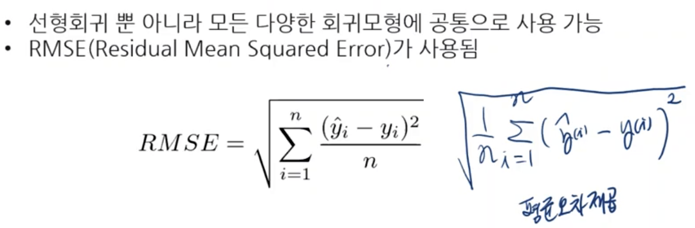
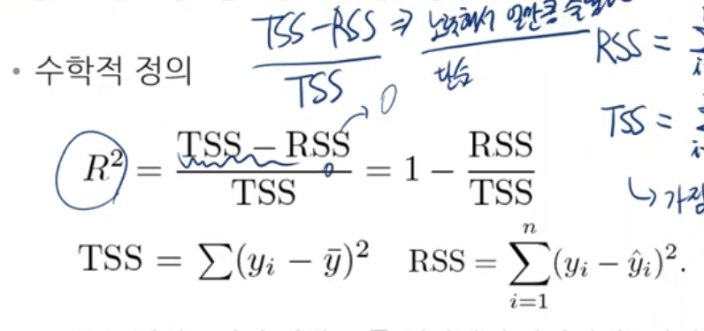
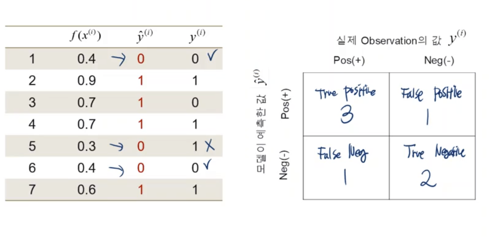
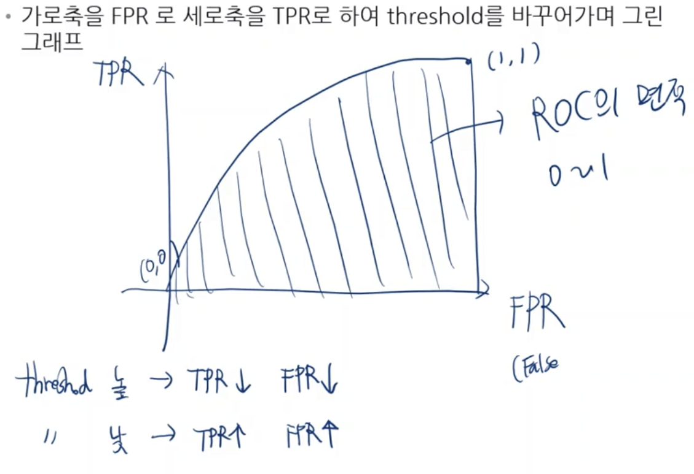

# 지도학습 모형의 평가
## 모델의 예측 정확도 평가
### 절차
> 1. 데이터 (x,y)를 사용하여 모형을 학습
> 2. 훈련에 사용된 데이터들을 다시 학습된 모형에 입력하여 예측값 계산
> 3. 정답 y와 y_hat 사이의 차이를 측정

### 회귀 모형의 정확도 평가 지표
#### `RMSE(평균 오차 제곱)` - `y의 단위`를 따른다
>   

#### `R2 Score(결정 계수)`  
>   
> TSS : 실제 데이터의 평균으로 똑같이 예측한다고 해을 때 실제 값과 편차  
> RSS : 회귀모형 적용 후 실제 변수와 예측된 변수사이의 제곱 합  
> 직관적 해석 : 회귀모형을 통해(학습된 weight - 노력) 실제값과 얼마나 차이를 줄였는가  
> 단위가 없음

#### R2 score vs RMSE  
- RMSE
  - 단일 지표로써 사용 불가 (비교 시에 의미 있음)
- R2 Score
  - 단일 지표로 사용 가능하나 활용분야에 따라 상대적 해석 필요
    - ex) 사회과학과 같은 분야에서는 R2 score가 낮아도 받아들여짐

## 분류 모델의 정확도 계산을 위한 confusion matrix
- True Positive (모델이 예측한 positive가 실제 값과 맞음)
-  False positive (모델이 예측한 positive가 실제 값과 틀림)
-  True negative (모델이 예측한 negative가 실제 값과 맞음)
-  False negative (모델이 예측한 negative가 실제 값과 틀림)

## 분류 모형의 정확도 평가 지표
- 정확도 (Accuracy)
  - `(TP + TN)/(TP + FP + FN + TN)`
  - 맞게 예측한 데이터 수 / 전체 데이터 수
- 정밀도 (Precision)
  - postitive라고 예측한 것 중에 실제로 얼마나 맞췄는가
  - `TP/(TP+FP)`
- 재현률 (Recall) 
  - 실제 참인 데이터를 얼마나 걸러냈는가
  - `TP/(TP+FN)`
- (ROC)
  - 
  - `TP/(TP+FN)`
### TPR vs FPR & Threshold
- TPR ( 합격해야할 사람을 합격시키는 비율)
  - 실제 positive 중 잘 분류된 값의 비율
    - TP / (TP + FN)
- FPR (불합격해야할 사람을 합격시키는 비율)
  - 실제 negative 중 잘못 분류된 값의 비율
    - FP / (FP + TN)
- Threshold (의사결정기준)
  - 낮아지면 ?
    - 합격이 쉬워진다 -> TPR이 높아진다 (합격률이 높아지니까 positive가 많아짐)
    - 불합격해야 하는 사람이 합격한다 -> FPR도 높아진다 (불합격해야할 사람도 합격하기 때문에)
  - 높아지면 ?
    - 합격이 어려워진다 -> TPR 감소(모델이 불합격 시켜서)
    - 합격 자체가 어려워 지니까 불합격해야할 사람이 합격할 확률이 줄어듦
## ROC

- roc의 면적이 넓을수록 더 좋은 그래프