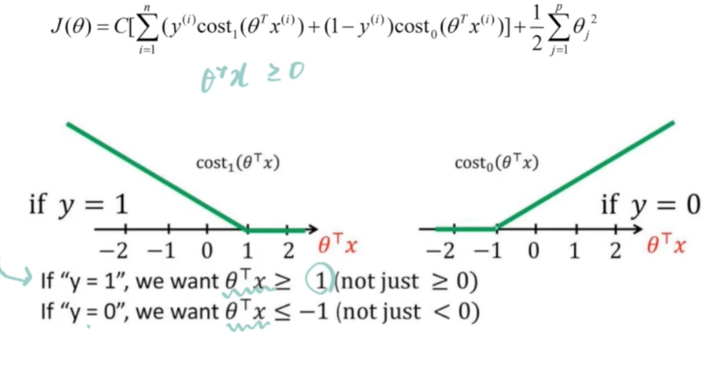
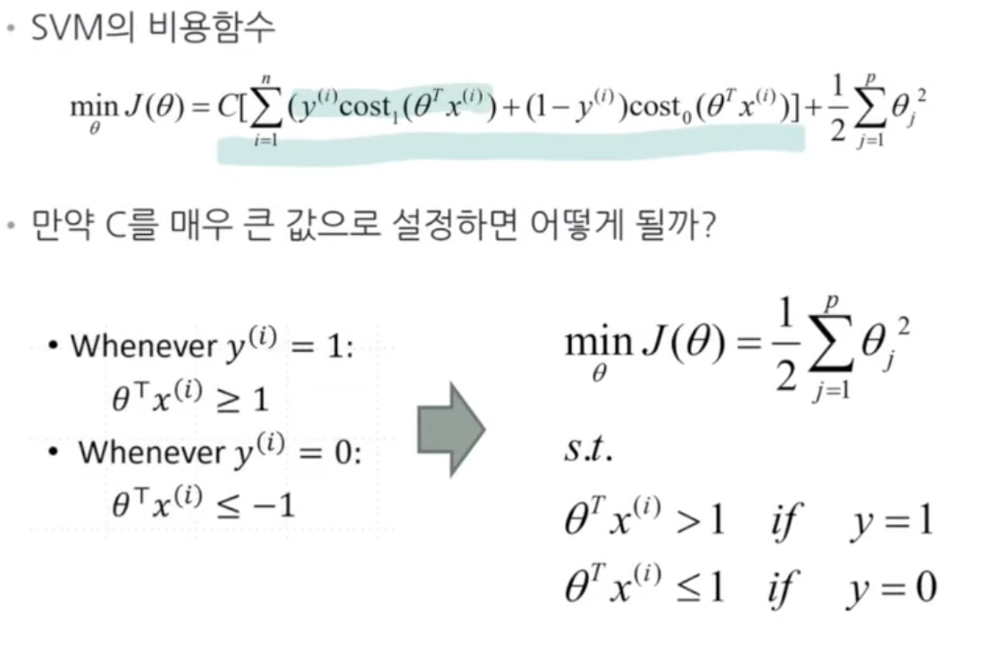
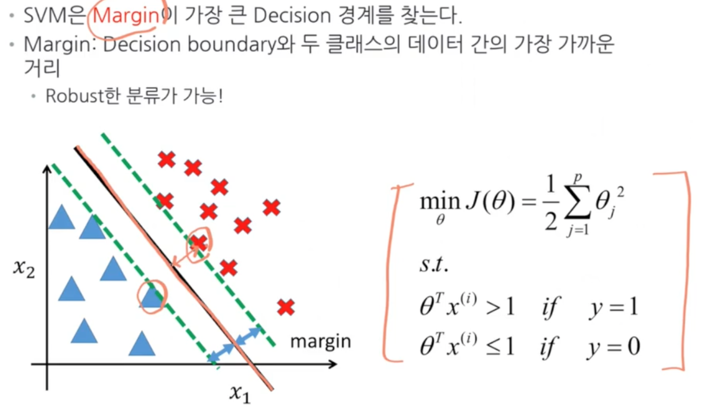
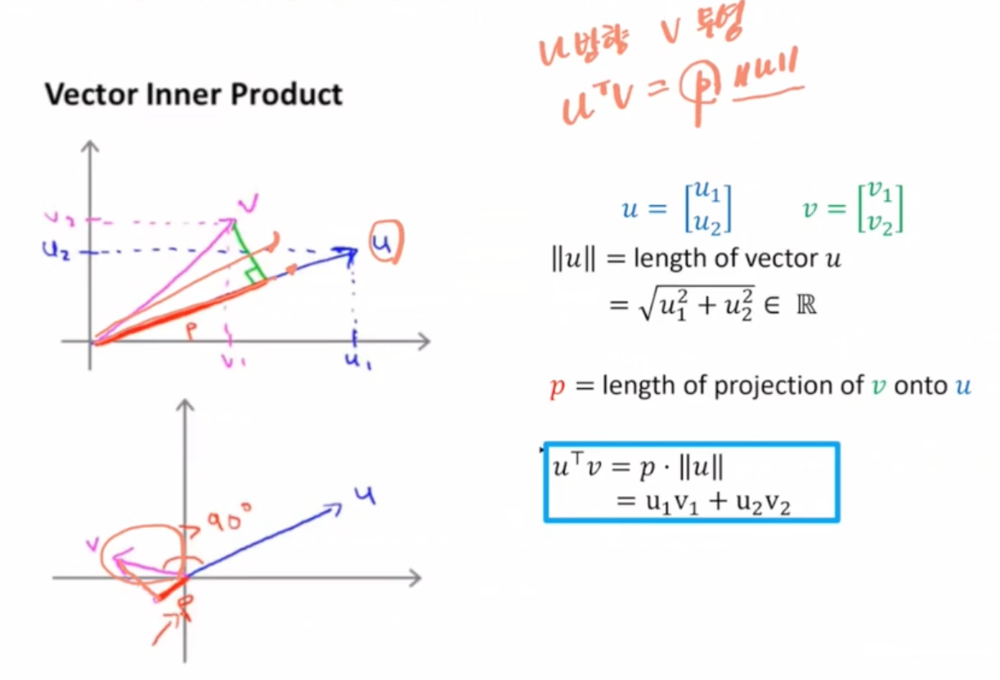
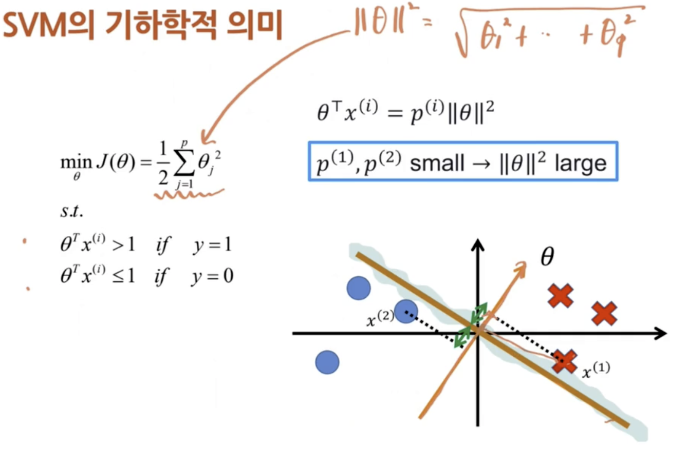
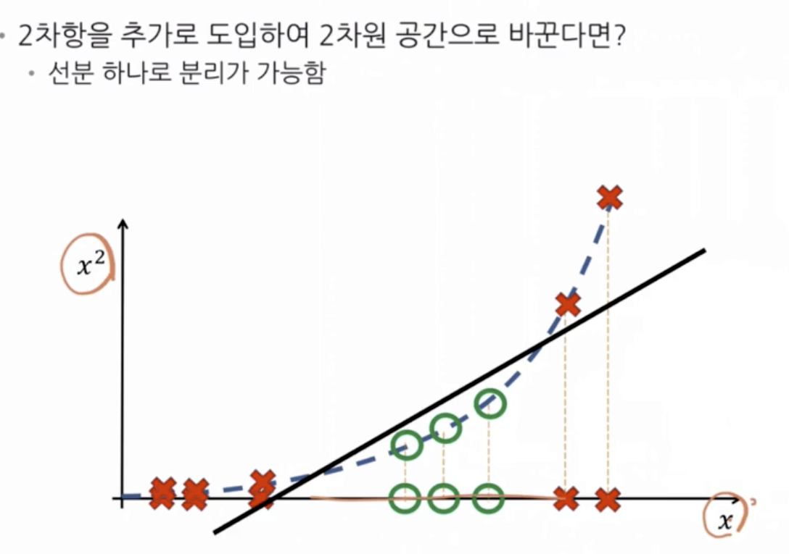
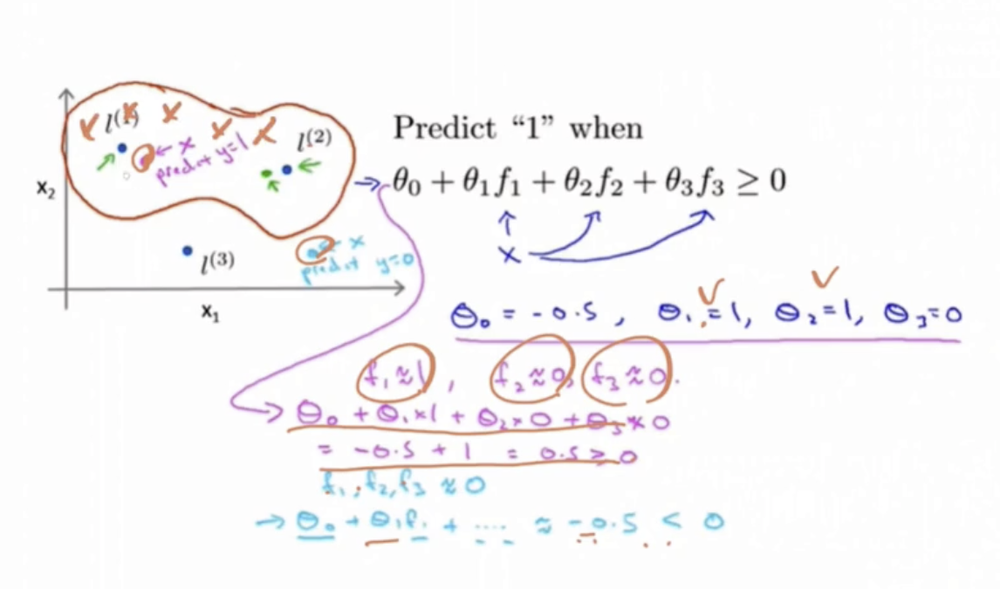
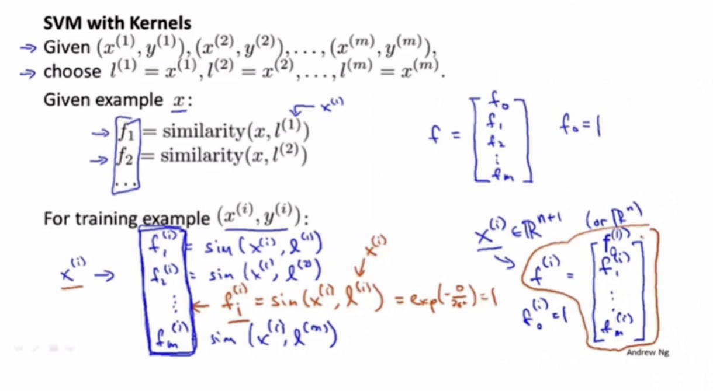
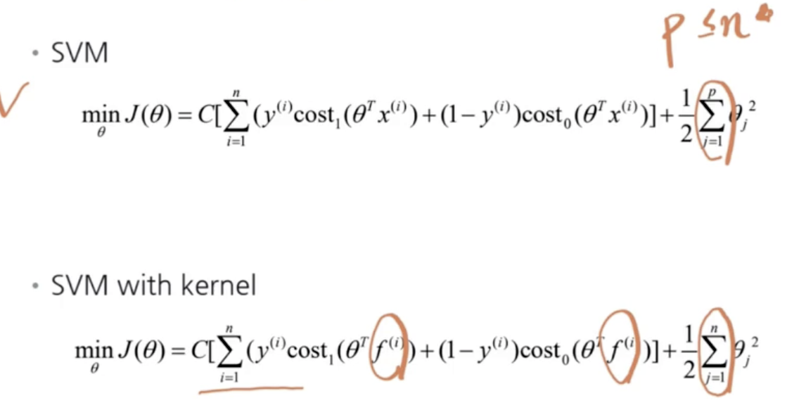
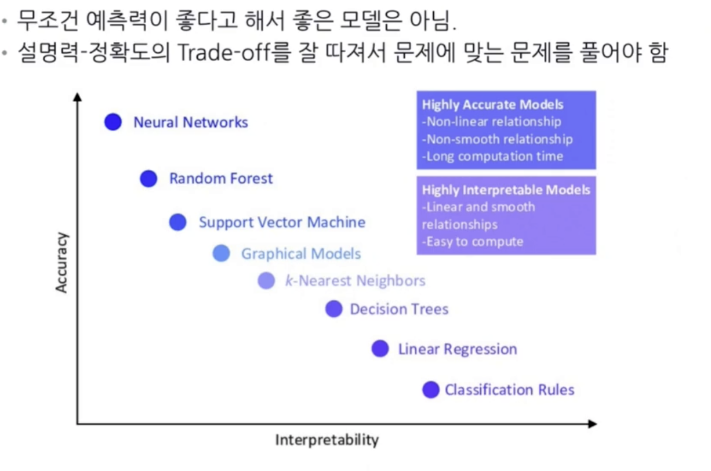

# SVM (Support Vector Machine)
- 회귀/분류 모두 가능하나 분류에 많이 사용

## vs 로지스틱회귀
## SVM의 비용함수

## SVM 비용함수의 의미

만약 `C가 매우 크다면` 비용함수에서 C의 우변이 0이 되어야 한다  
- y가 0일 경우엔 -1 이하가 되어야 하고
- y가 1일 경우엔 1 이상이 되어야 한다

이 떄, 우리는 위 사진에서 최적화 해 식과 똑같은 문제를 푸는 것으로 접근이 가능하다
> 최적화 문제를 푸는 $\theta$ 를 찾게되면 1과 0을 분류하는 경계선을 구할 수 있다

## SVM의 기하학적 의미

> 최적의 margin은 오른쪽 공식의 해

- $u^Tv$는 u에 v를 projection시킨 것
- p는 v를 u에 정사영 시켰을 떄의 길이, $||u||$는 u의 길이
- v의 각이 u와 가까울수록 p의 길이는 길어짐
## SVM의 기하학적 의미2

- 해당 사진에서 의사결정경계선과 직교되는 벡터 $\theta$에 데이터를 정사영 시켰을 때 margin이 제일 큰 것이 결국 $minJ(\theta)$가 된다. (부등식을 만족하면서)

## Non Linear Decision Boundary
- 정사영을 통해

> 저차원 공간을 고차원 공간에 투영시켯거 푸는 것이 핵심

## Kernel (커널)
- 아이디어
  - 저차원(original data) 데이터를 고차원 데이터로 변환하여 분리가 가능토록 하자
- HOW?
  - 여러 개의 landmark(기준점 : 고차원 공간에서 찾을 데이터를 찾을 떄의)을 정의
  - 새로운 feature : 기존 데이터가 각 기준점에 대해 얼마나 가까운지를 측정

### 원리
ex)  
- 새로운 x가 있을 때 f1, f2, f3로 표현하고자 함
- 각각의 feature별로 첫번째 l1(landmark1), l2, l3와 비교하여 계산해서 구함
- 그렇게 나온 새로운 f1, f2, f3로 학습함. 이 때, 각각의 f들은 landmark와 얼마나 가깝냐에 대한 지표

## Gaussian Kernal(커널)
- `분산이 크면` -> 덜 가까워도 유사하다고 판단(등고가 차이 많이 안 나므로)
- `분산이 작으면` -> 가까워도 멀다고 판단 (등고의 차이가 많이 나서)

## Kenrel을 이용한 비선형적인 데이터의 분류
- Landmark와 Kernel의 개념을 이용해 비선형적인 분류 가능

만약 그림과 같은 상황이라면  
데이터가 l1과 l2에 가까울수록 1로 분류될 확률이 높음(비선형적 패턴)  
각각의 랜드마크와 얼마나 가까운지를 측정하여 얘를 학습

## Landmark의 선정
- Training Data에 존재하는 모든 점을 landmark로 둔다(n개의 landmark - n개의 feature) 

## Kernal SVM의 학습

## SVM의 하이퍼 패러미터

- 분산이 작다면 랜드마크와 굉장히 붙어 있어야 유사하다고 취급
  - 따라서 오밀조밀하게 형성되므로 유연성이 커짐
- 분산이 크다면 그 반대

## 언제 SVM을 사용하는가
- Feature 수가 Obervation의 수보다 많을 때
  - Logistic Regression
  - SVM whithout Kernel
- Feature의 수가 적고(p=1~1000) Observation의 수가 중간 사이즈일 때(n=10~10000)
  - SVM with Gaussain Kernel
- Feature의 수가 적은데(p=1~1000) Observation 수가 매우 많을 때 (10000개 이상)
  - Logistic regression
  - SVM without kernel

## SVM의 장단점
### 장점
- 최적화 이론에 기반한 decision boundary
- 근사 알고리즘을 사용하는 다른 방법에 비하여 이론적으로 완벽한 의사결정선을 파악할 수 있음

### 단점
- 커널 방법을 사용할 때, 데이터의 숙다 증가할수록 계산 복잡도 기하급수적 증가
- 크고 복잡한 패턴이 조ㅓㄴ재하는 데이터에 대해서는 사용하기 어려움

## Model Trade-off
