# Unsupervised Learning (차원축소)
- 주어진 데이터의  정보를 최대한 보존하면서 적은 수의 변수로 표현
Ex) 3차원 -> 2차원

## 정보손실을 최대한 줄이면서 2개로 줄이고 싶다 
- 정보를 줄이면서 새로운 feature로 압축 (기존에 존재하지 않는 데이터)
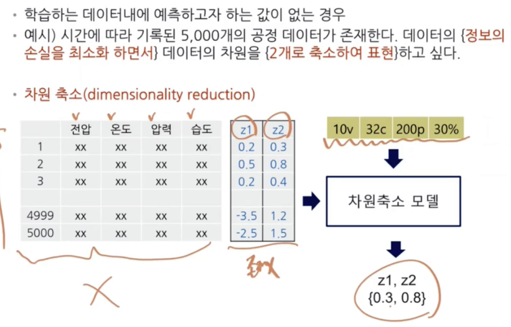

## 차원축소의 이점 - 시각화
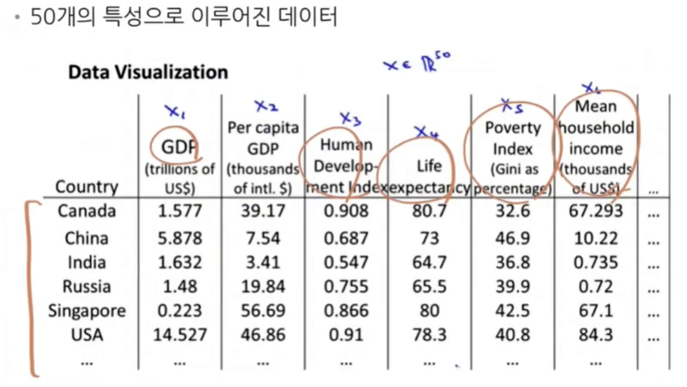
2개의 차원으로 축소 시행
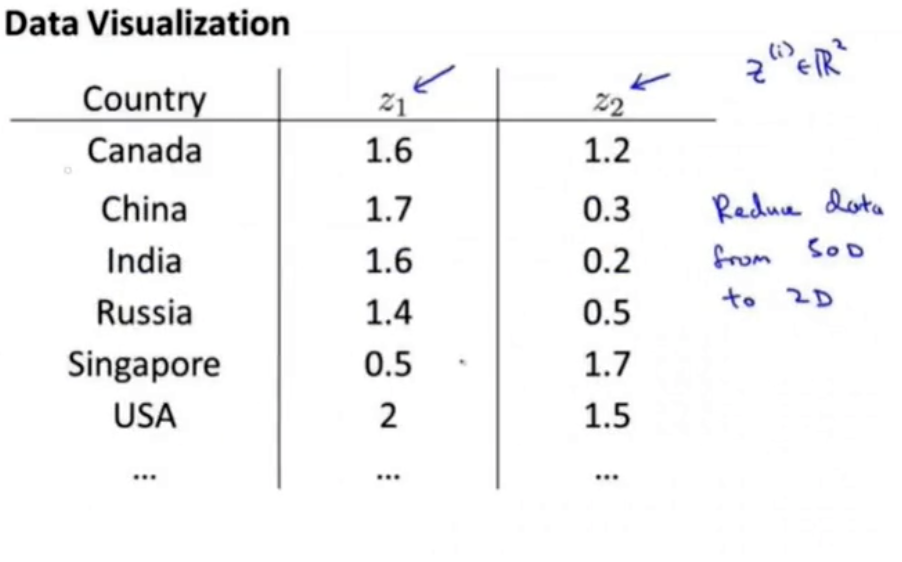
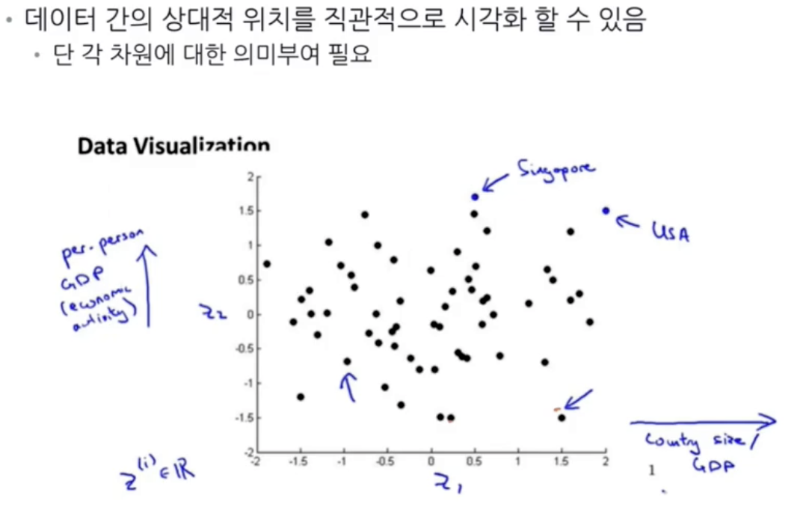

## 차원축소의 이점 - 차원의 저주 극복 가능
- 특성 선택 : 중요 변수만을 선택
- 비지도 학습 기반 차원축소 기법 사용 (`차원축소는 여기에 해당`)

## 차원축소 아이디어
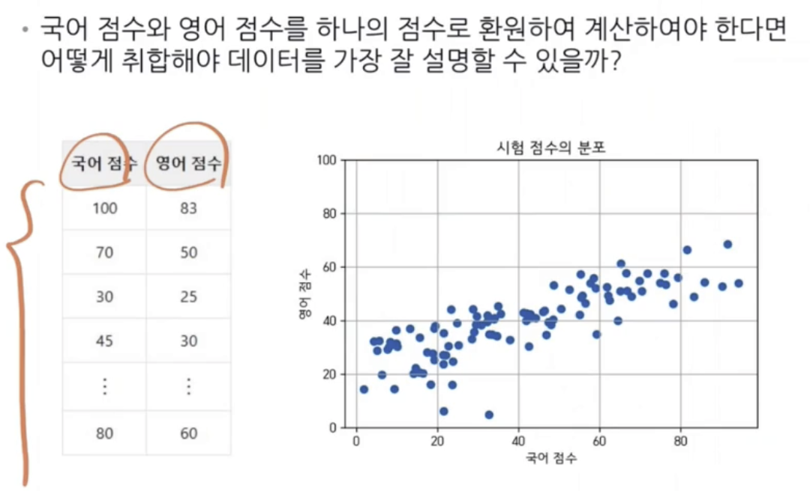
ex) 5:5로 가중치 두는 것과 같이 비율로 섞는 방법
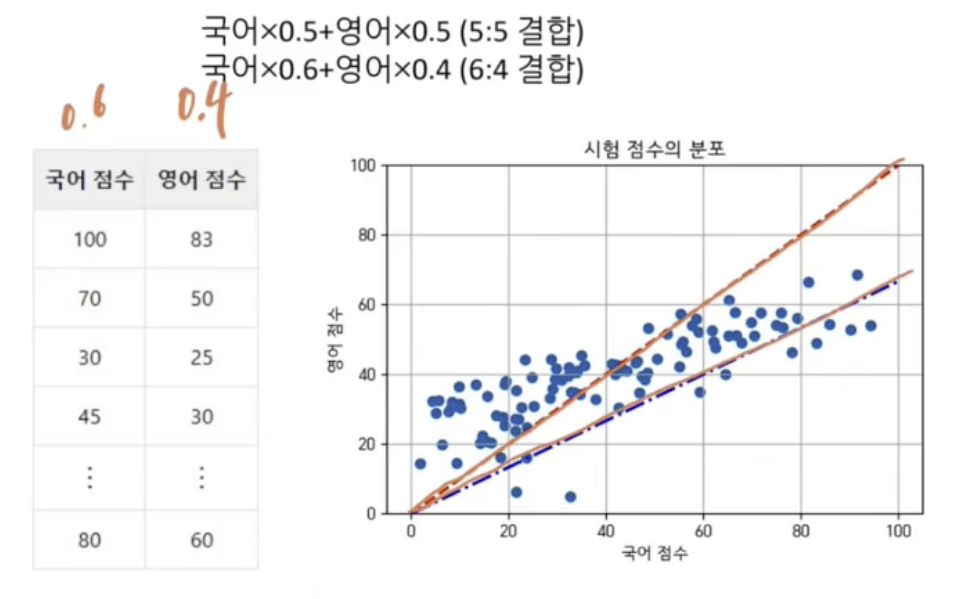
- 취합된 점수는 직선에 정사영된 값으로 해석 가능
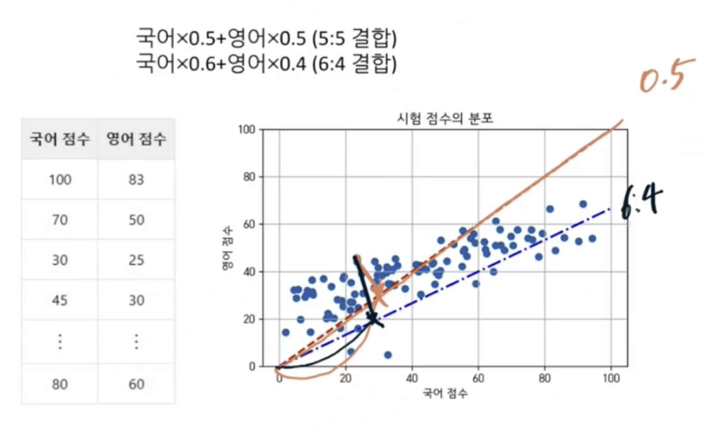
> 점수의 환산은 각 비율에 따른 그래프에 데이터를 정사영 시켜서 나온 직선의 길이로 볼 수 있음

## PCA (principal Component Analysis)
- 어떤 방향으로 정사영해야 데이터의 정보가 최대한 보존될까 (분산을 최대화)
  - 다른 데이터 간의 차이를 최대한 벌려주는 것이 좋을 것이다(데이터 간에 변별력(차이)을 가지게 하기 위해) -> 사영 후 데이터 간의 분산이 커야함
  - C1방향으로 사영했을 때, 데이터 사이 분산이 가장 큼

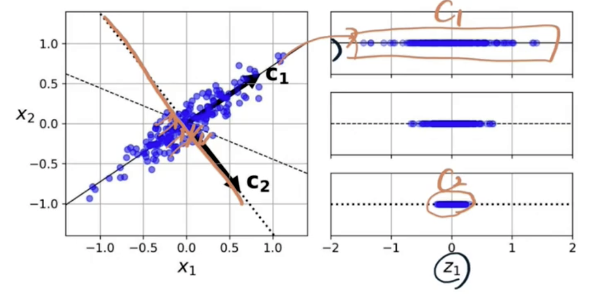

### 주성분 분석
- 전체 p개의 차원에서 데이터의 분산을 최대한 보존할 수 있는 K개의 직교하는 차원을 찾는 방법 (차원이 같아도 되지만 다른 값을 가져야 함)

## PCA 알고리즘
1. 데이터 센터링 (data normalization)
2. 최적화 문제 정의
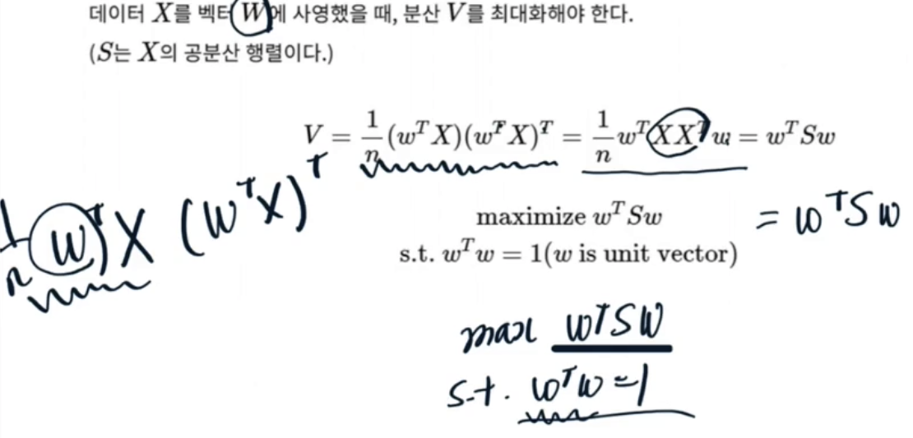
3. 최적화 문제 해결
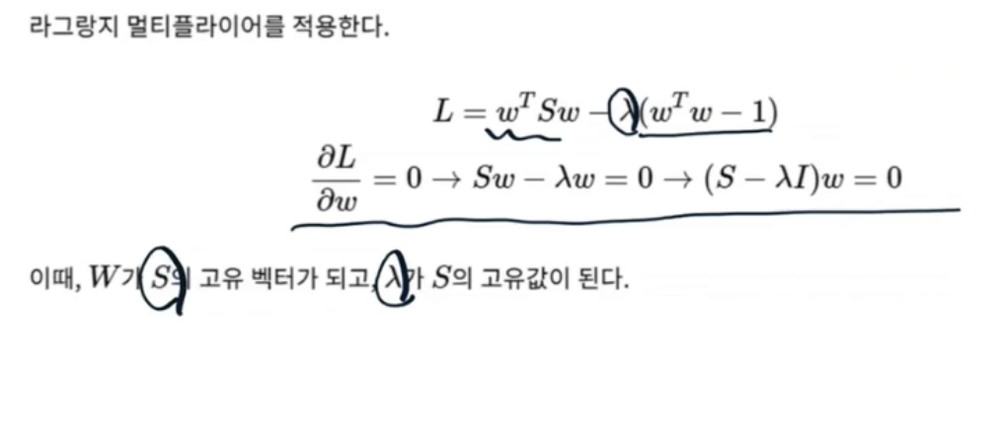

## PCA 알고리즘 결과 - 고유벡터 및 고유값
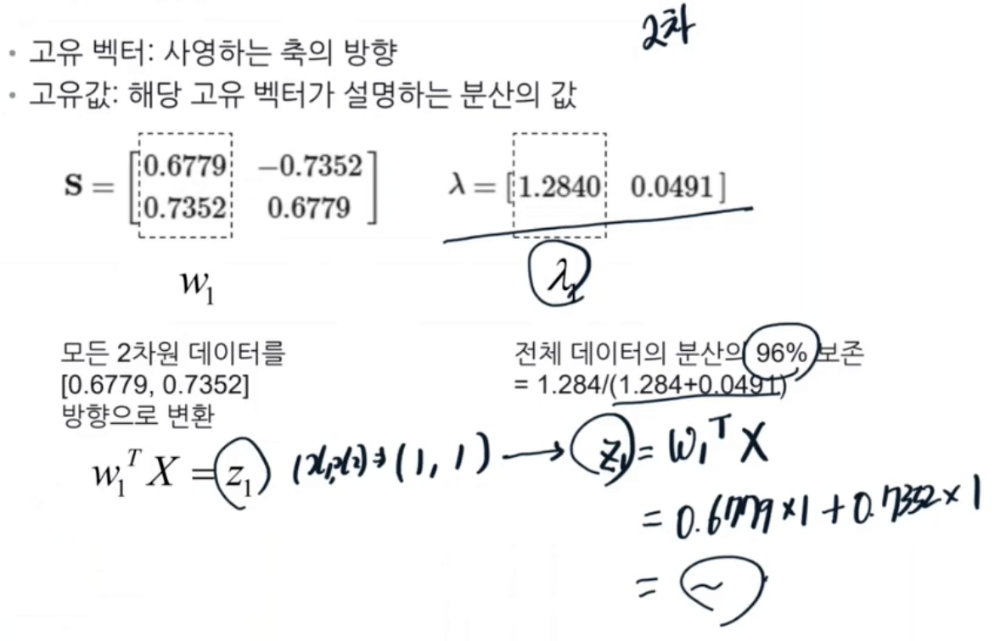
$Z_1=0.6779x_1+0.7352x_2$
## 주성분의 개수 선정하기
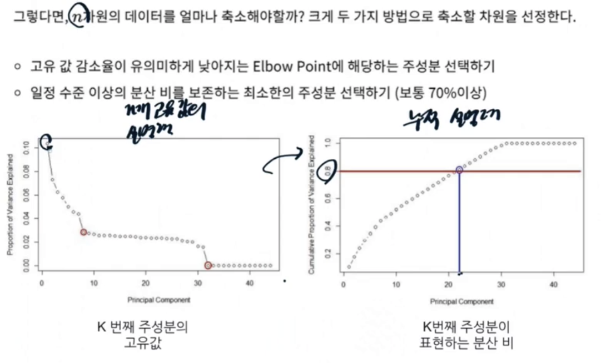
- 오른쪽의 누적 설명력 그래프를 보고 적당한 지점에서 잘라서 분석

## 주성분 해석하기
- 각각의 feature(기존 feature : age, .. ) 값이 변화할 때 주성분이 어떤 영향을 받는지 시각화

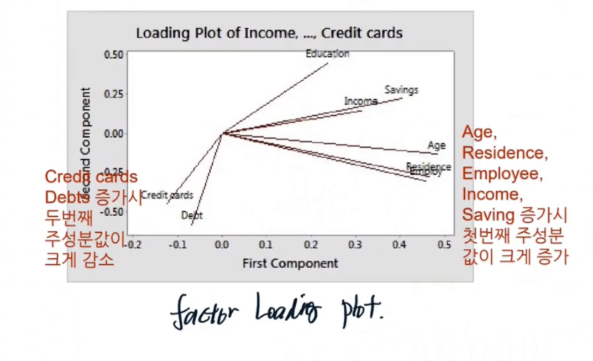
ex) 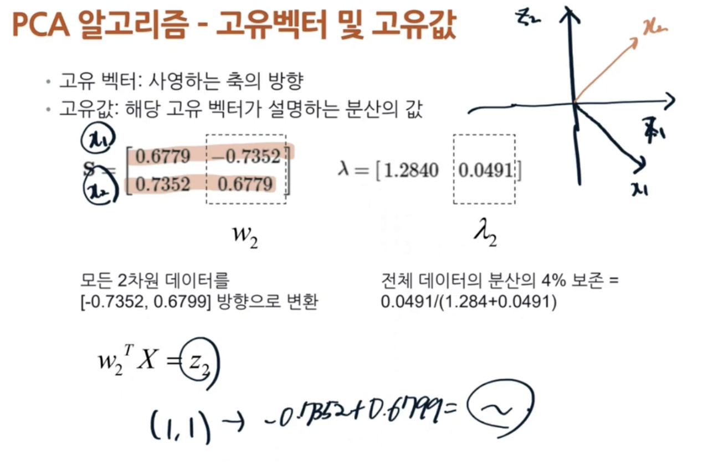

## 죽성분 해석하기 - loading plot
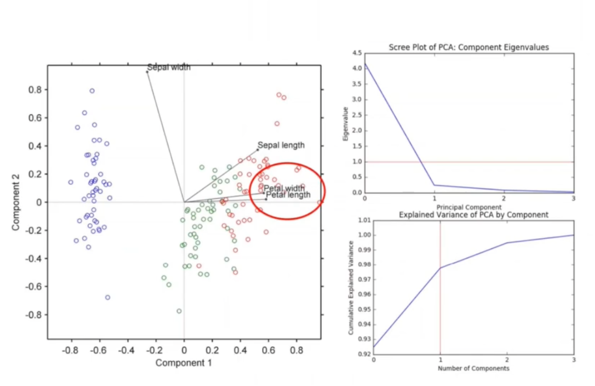
- iris dataset에서 4가지의 feature을 2가지로 줄이고 factor loading plot 과 data를 찍은 그래프

## 주성분에서 원데이터로 복구
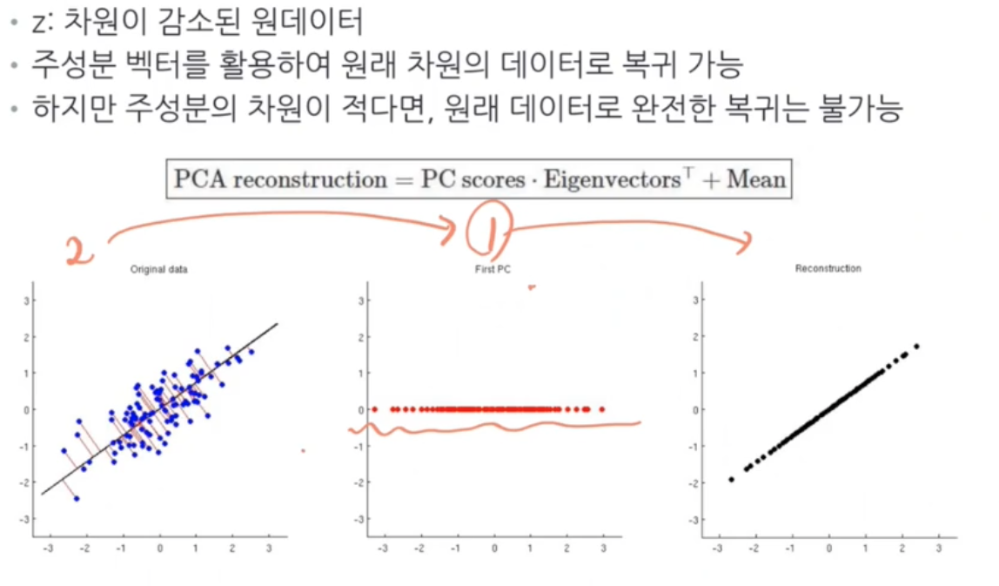
- vision도 마찬가지로 여러 주성분을 사용하면 복귀했을 때 손실이 덜함

## PCA의 주용도
- 압축 
  - 저장되는 데이터의 메모리/디스크 감소
  - 학습 알고리즘의 속도 증가
- 시각화
  - 차원을 낮추어 데이터의 전체적인 분포에 대한 인사이트 도출
  - 이상치/군집가능성 파악

## PCA의 올바른 사용
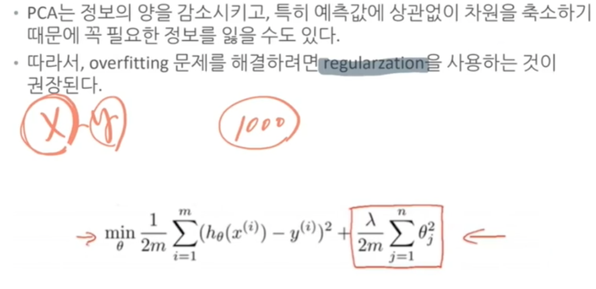
- feature수가 많을 때 한번 사용해보는 것을 권장
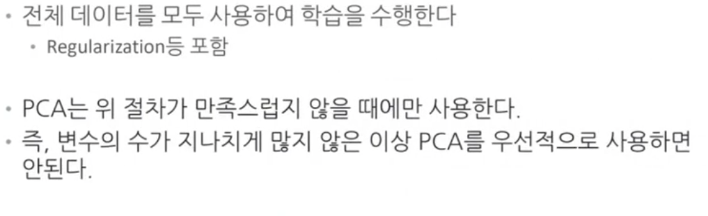
