# ensenble model
- 하나의 모델이 아니라 여러개 모델의 투표로 Y값을 예측
- Regression 문제에서는 평균값으로 예측
- meta - classifier
  - 하나의 classifier가 다른 것들과 연계되어 만들어지는
- stacking (meta - ensemble) 등으로 발전
  - ensemble + ensemble
- 학습은 오래 걸리나 성능이 매우 좋음
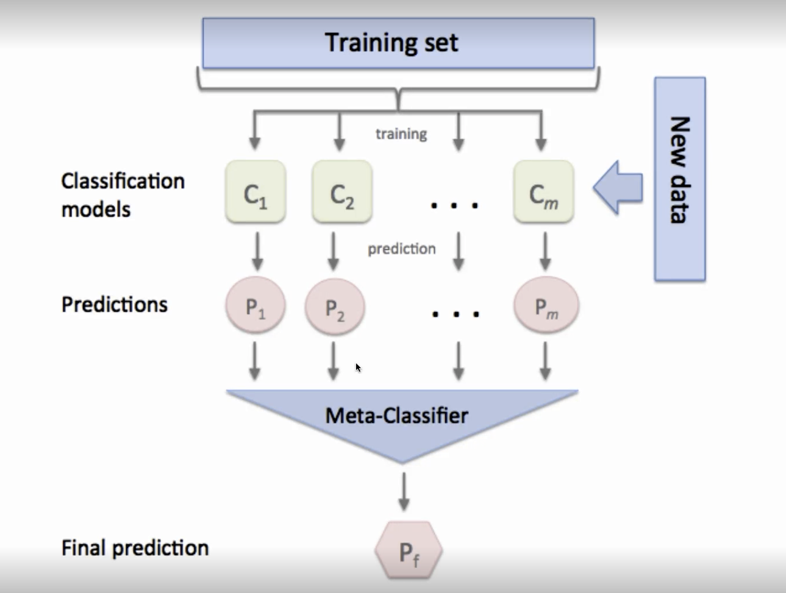

### key words
- vallila ensemble (voting)
- Boosting (sampling을 통해)
- Bagging (Boosting을 aggregation)
- Adaptive boosting(AdaBoost)
- XGBoost
- Light GBM
---
## Voting classifier
- 가장 기본적인 ensemble classifier
- 여러 개의 Model의 투표를 통해 최종 선택 실시
- Majority voting or Vallila ensemble 모델이라고 불림

### sklearn.esnsemble.VotingClassifier
- estimators : list형태로 여러 model들이 들어간다
- voting
  - hard : sum해서 다수
  - soft : 확률로 변환하여 각 feature의 weight값이 가장 높은 친구 선택
- weights : 각각의 모델이나 클래스에 weight를 준다
- n_jobs : cpu를 얼마나 쓸 것인가
---
## Sampling
- 단순히 같은 데이터 셋으로 만들면 ensemble의 효과를 볼 수 없음
- 다양한 sampling dataset으로 다양한 classifier를 만들어야함 

### Bootstrapping - Bagging
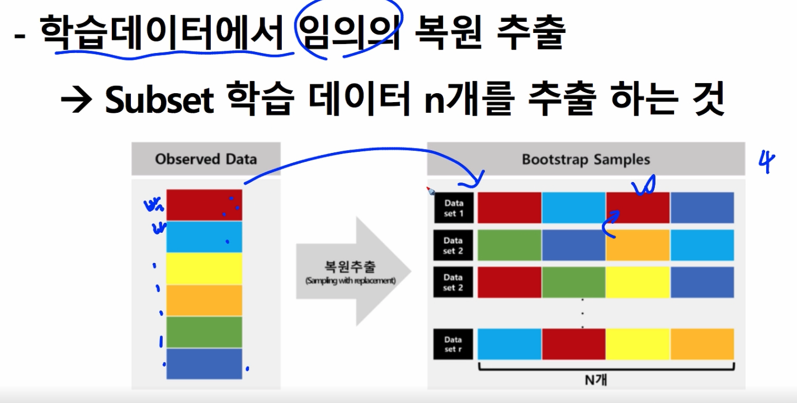
- 데이터를 외부 추가 없이 추출하는 것

#### 0.632 bootstrap
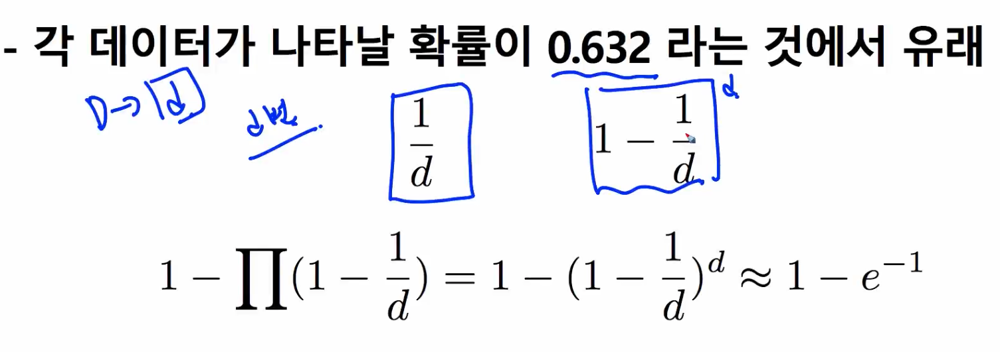

## bootstrap을 이용해 data ensemble을 만드는 것을 Bagging(Bootstrap Aggregatin)
- Bootstrap의 subset smaple로 모델 N개를 학습 (앙상블)
- Vallila ensemble과 달리`하나의 모델`에 다양한 데이터를 넣는다
- High variance(over fitting이 심한) 모델에 적합
- Regressor(평균 or median), Classifier 모두 존재
  - DT의 경우 prunning 할 필요가 없는데 Bootstrap은 overfitting된걸 합쳐서 성능을 내기 때문에 overfitting이 되어도 그냥 놔둔다

### out of bag error
- OOB (out of bag error)인 sub sampling을 하고 남은 데이터로 모델 성능을 측정
- validation set과 유사

### sklearn.ensemble.BaggingClassifier/BaggingRegressor
- base_estimator : 하나의 모델을 넣는 것이기 때문에 model name
- n_estimators : bootstrap을 몇 개 할 것인가
- max_samples : 하나의 데이터를 얼마나 넣을 것인가
- max_features : 몇 개만 사용해서 학습을 할 것인가
- bootstrap : 
- bootstrap_features : 
- oob_score : bagging의 성능 측정을 위한 Validation
- warm_start : 이전의 학습된 데이터를 넣을 것인지
- n_jobs : cpu 몇 개
---
## RandomForest (Bagging)
- Bagging + Randomized decision tree
- variance가 높은 decision tree들의 ensemble
- 가장 간단하면서 높은 성능 자랑

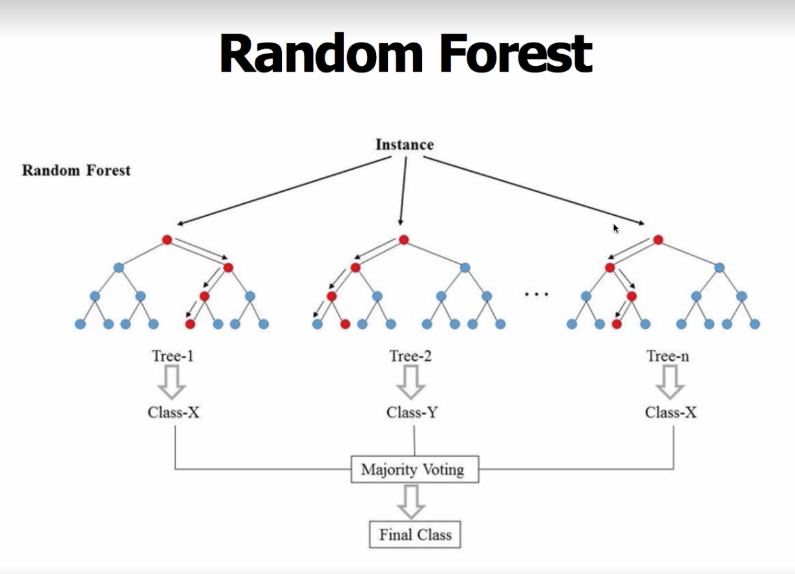
- tree들이 연관관계가 적어야한다 (모양이 다른 tree가 돼야함)
- correlation이 낮은 m개의 Subset data로 학습 -> m개의 트리가 만들어진다
- split시 검토대상 feature를 n개 random하게 선정
  - 전체 feature를 p라 할 때, n = p이면 bagging tree
- feature의 재사용이 가능하며 주로 n=$\sqrt{p} 또는 p/3$
- variance가 높은 트리 사용 -> last node 1~5

### sklearn.ensemble.RandomClssifier
- max_features: split할 때 몇 개의 Feature를 쓸 것인지

---
## Boosting
- 학습 Round를 진행하면서 모델 생성
  - 모델에 의해 각 instance(tuple) weight를 업데이트
- Instance 오답 weight가 높은 instance를 중심으로 모델을 생성
  - 잘못 분류되면 잘못 분류될수록 오답의 WEIght를 높임
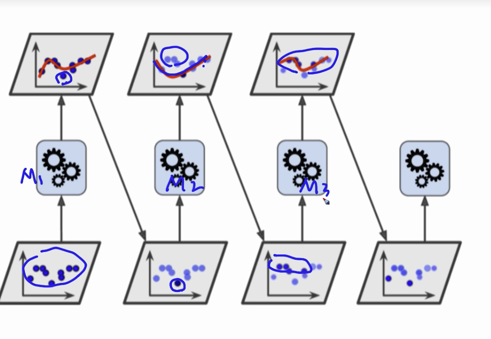
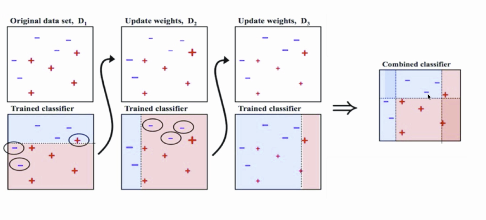

### Adaboost
- Adaptive Boosting
- 매 라운드마다 instance의 오답 Weight 값 계산
- 틀리는 instance의 weight up -> 오답 weight 기준으로 resampling
- Instance 오답 weight 합이 클수록, model의 weight를 줄임(예측 잘 못 하는 모델의 weight를 줄인다)
- 비슷한 모델끼리 넣으면 결국 Bagging과 유사하기 때문에 weak-learner들로 구성한 분류기를 만든다(high bias)
  - 따라서 overfitting이 잘 일어나는 high depth DT, NN은 base model로써 적합하지 않음

### algorithm
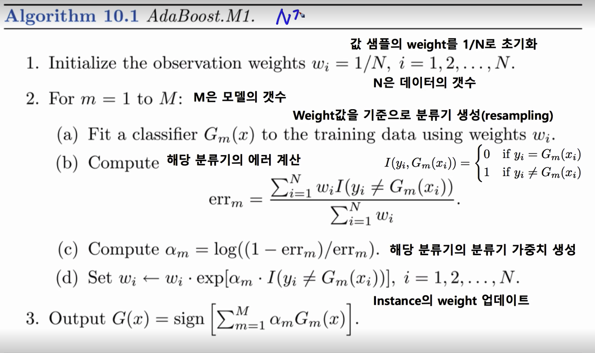
1. 초기 weights는 데이터의 개수인 $\frac{1}{N}$으로 설정
2. 모델의 개수 지정(hyper parameter)  
  (a) weight 값($w_i$)을 기준으로 분류기 생성(resampling)  
  (b) 틀린 놈의 $err_m$을 구해준다  
  (c) 해당 모델의 err을 통해 모델 가중치($\alpha_m$)를 만든다.  
  (d) $w_i$를 업데이트 시킨다
3.

### Adaboost with stump
- Adaboost의 classifier를 1-depth tree를 사용하는 기법
- DT가 첫번째 split에 의해 만드는 것이 데이터에 민감하기 때문에 주로 사용(high bias)

## Bagging vs Boosting
- Bagging
  - Subsampling을 통해서 ensemble
  - 병렬화 가능
  - 각각의 subsamplingd을 한 모델들이 합쳤을 때 괜찮더라 -> high variance한 base estimator가 되면 좋음
  - 데이터셋이 굉장히 variance가 높으면 괜찮은 성능을 보임
- Boosting
  - 계속해서 업데이트
  - 병렬화 힘듦
  - boosting은 bias가 높은 weak-learner들이 계속 업데이트 되면서 학습하기 때문에 high bias(각각이 좀 다른 예측을 하는)한 base estimator가 되면 좋음
  - boosting은 비용이 높은 편

## sklearn.ensemble.AdaBoostClassifier
- bset_estimator : 
- n_estimator : 같은 형태의 classifier를 몇 개 넣은건지
- learning_rate :
- algorithm : 

---
## Gradient Boosting
- Sequential + Additive Model
- 이전 모델의 Residual를 가지고 Weak learner를 강화함
- residual을 예측하는 형태의 모델

### procedure example
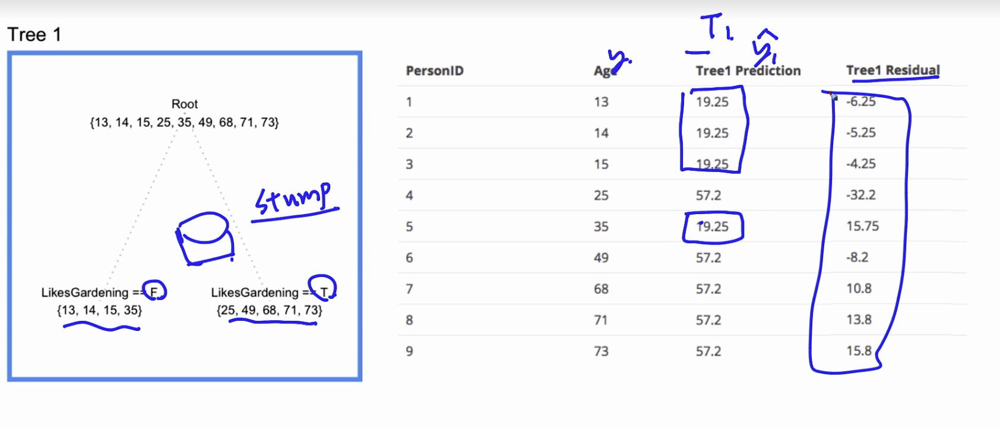
- stump를 구해서 residual을 구한 뒤 그 residual을 통해 다음 모델의 residual을 구한다
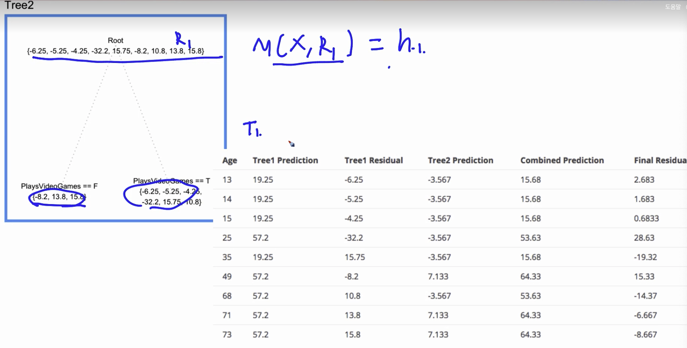
- Tree 1 Prediction = base model = f1
- Tree 2 Prediction = h1
- Combined Prediction = f1 + h1 = f2

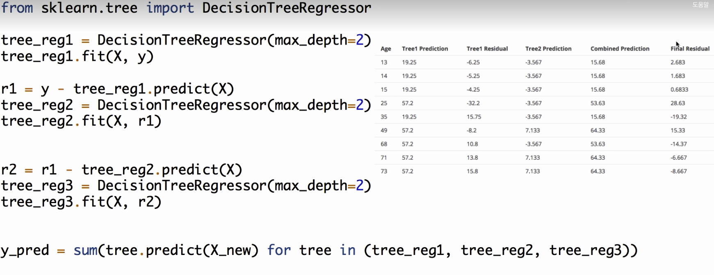
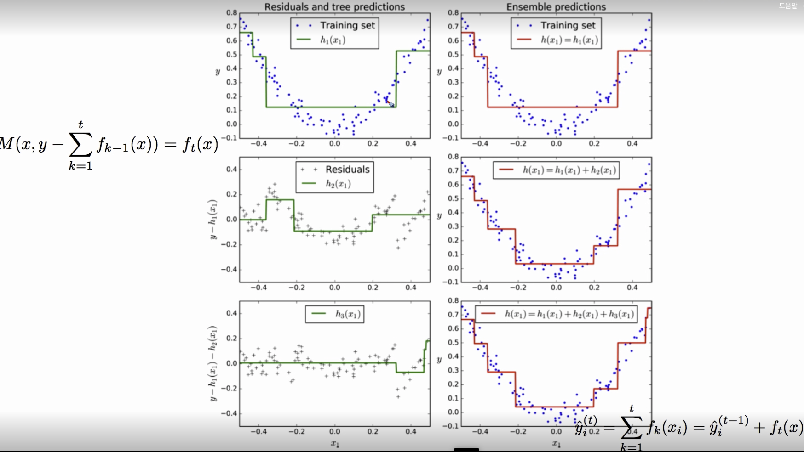

### Turning parameters
- number of tree (estimators): 몇 개의 모델
- depth of tree 
- subsampling
- shrinkage parameter (learning rate): 작을수록 뒷 모델이 영향을 덜 줌 -> 모델(estimator)을 늘려야함
- fitting to low variance(weak learner로 해야함)

### sklearn.ensemble.GradientBoostingRegressor
- loss : ls(Squared error), lad, huber, quantile
- learning_rate : $\lambda$
- n_estimators : 트리의 개수
- max_depth : weak learner를 위해 작게
- subsample : 데이터 샘플링

---
## XGBoost (eXtra Gradient Boost)
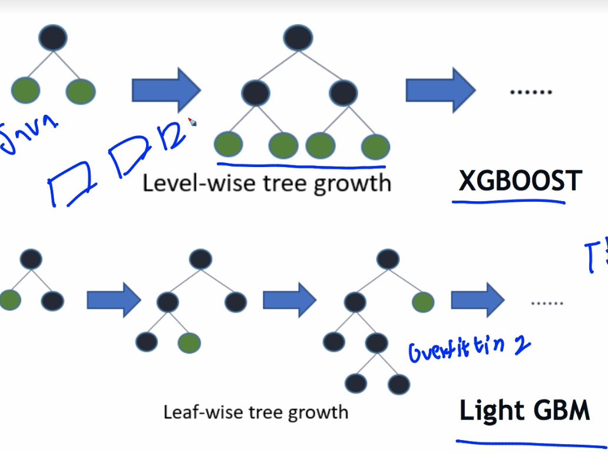
### 주요 장점
- 뛰어난 예측 성능
- GBM 대비 빠른 수행시간
  - CPU 병렬처리 및 GPU 지원
- 다양한 성능 향상 기능
  - Regularization 기능 탑재
  - Tree Pruning (sklearn.GBM에는 없음)
- 다양한 편의 기능
  - Early Stopping
  - 자체 내장된 교차검증
  - 결손값 자체 처리

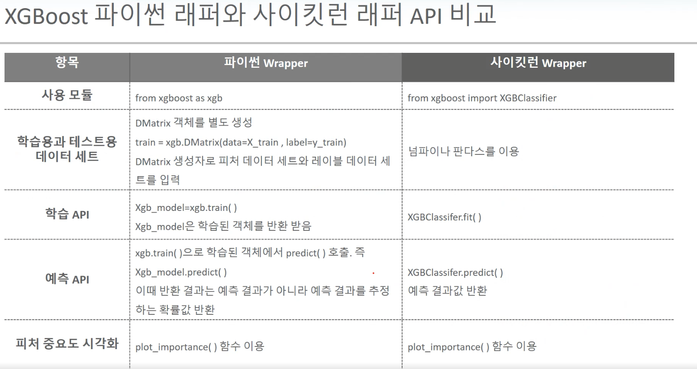
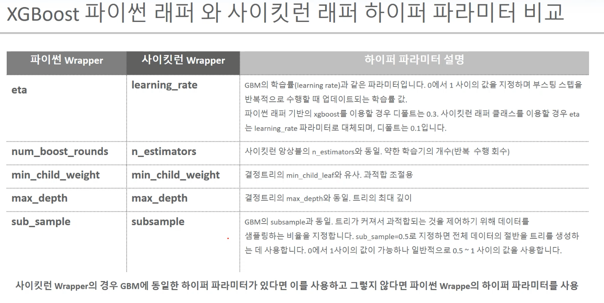
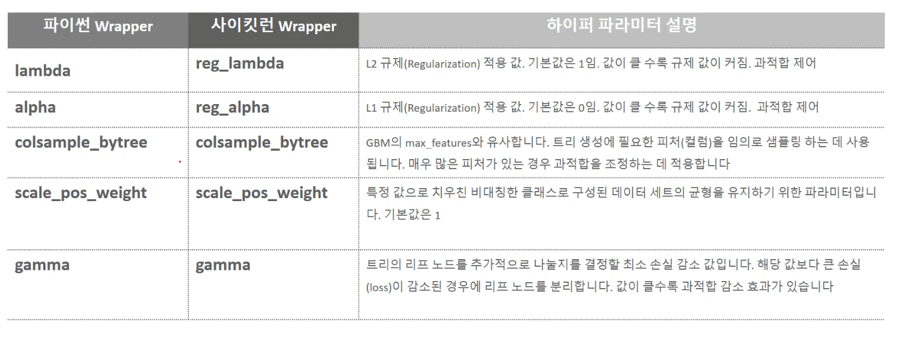

### parameter
- max_depth
- eta : learning rate
- objective : objective function(cost function)을 뭘 쓸건지
- eval_metric : evaluation을 뭘 할건지
- num_boost_round : 몇 번의 iteration을 쓸 것인지
- early_stopping_rounds : 몇 번에서 자를 것인지(best score가 나오고 지정한 횟수만큼 더 실행해서 더 나은 loss가 없다면 끝냄)