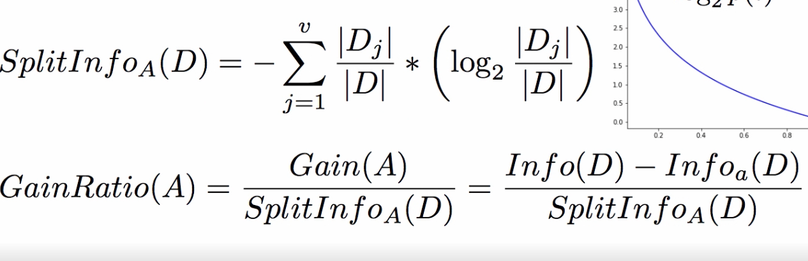
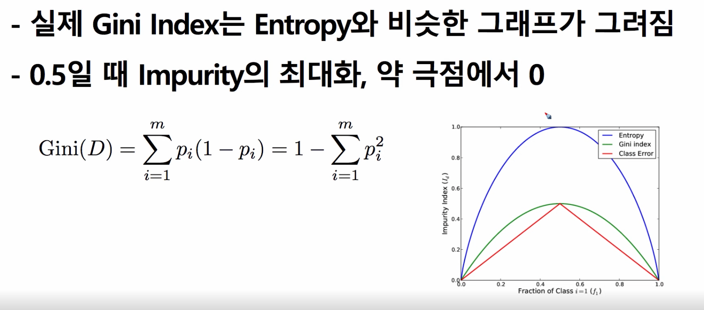
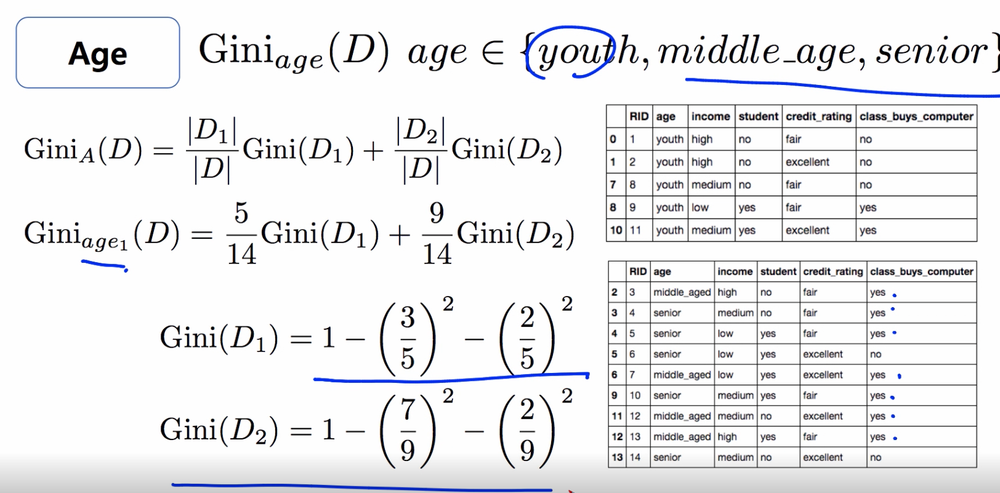
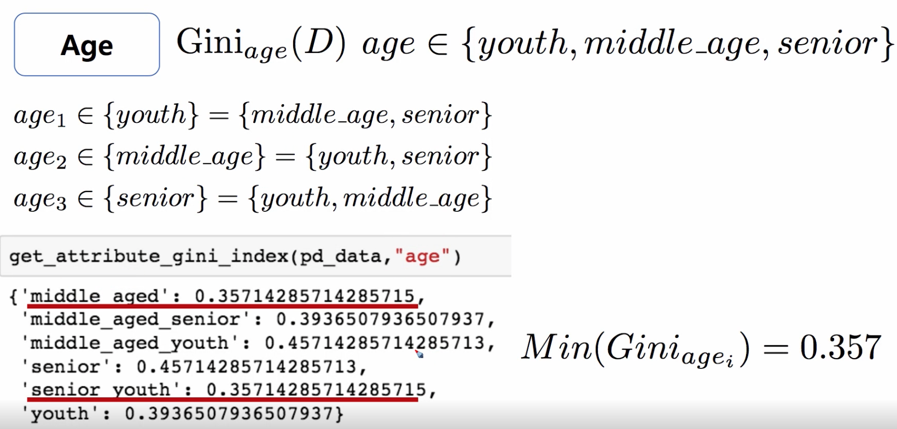
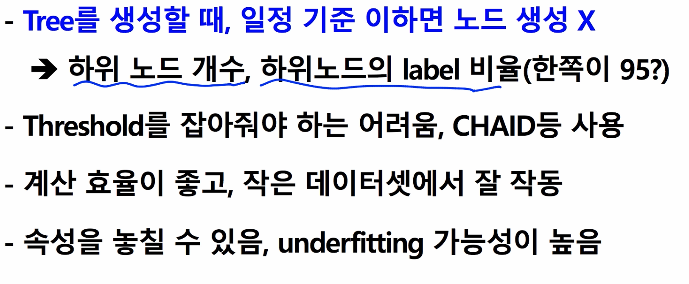
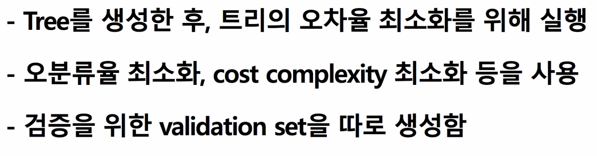

# Decision Tree
## Entropy
- 혼잡성
- 높을수록 불확실성이 높다
- 목적달성을 위한 경우의 수를 정량적으로 표현하는 수치
$h(D) = -\sum_{i=1}^{m}p_ilog_2(p_i)$  
i : Y의 종류
## Growing a Decision Tree
- Decision Tree를 성장 시키는 알고리즘이 필요
- Data attribute를 기준으로 분기를 생성
- 어떤 attribute 기준이면 가장 entropy가 작을까
- 하나를 자른 후에 그 다음은 어떻게 할 것인가
> - Decition Tree는 재귀적으로 생김
> - 대상 라발에 대해 더 확실한 정보를 제공하는 attribute를 선택
> - overfitting 방지를 위해 pruning을 통해 일반화 시행
> - 일반적으로 효율을 위해 Binary Tree를 사용
### 특징
- 비교적 간단하고 직관적으로 결과 표현 가능
- 훈련시간이 길고, 메모리 공간을 많이 사용
- Tio-down + Recursive + Divide and Conquer 기법
- Greedy 알고리즘 -> 부분 최적화
### 장점
- 트리의 상단 부분들이 가장 중요한 예측변수
- Attribute의 scailing이 핋요없음
- 관측치의 절대값이 아닌 순서가 중요 -> Outlier에 이점
- 자동적 변수 부분선택 (Tree pruning)
### 종류
- ID3 -> C4.5 (Entrophy)
- CART -> Gini
- 연속형 변수를 위한 regression tree도 존재
## Information Gain
- 엔트로피함수 도입하여 branch spliting
- 전체 Entropy - 속성별 Entropy 로 계산
> - 전체 데이터 $Info(D) = -\sum_{i=1}^{m}p_ilog_2(p_i)$  
i : Y의 종류, D는 전제 데이터  

> 속성 A로 분류시 $Info_A(D) = -\sum_{j=1}^{v}\frac{|D_j|}{D}*Info(D_j)$    
j는 라벨의 종류 (ex : A = 색, j = 1,2,3...는 빨강 노랑 파랑 등)  

> $Gain(A) = Info(D) - Info_A(D)$

### Information Gain의 문제점
- Attribute에 포함된 값이 다양할수록 선택하고자함
- 애초에 엔트로피개념이기 때문에 상대적으로 다양하면 혼잡도가 낮아질 가능성있음

> 보완해줄 measure가 필요한데 ID3의 발전형인 C4.5 알고리즘

## Gain Ratio
- 원리 : attribute의 값이 다양하면 할수록 penalty를 준다

## Gini Index (CART알고리즘의 split measure)

- Binary Split을 전제로 분석함

## Tree pruning
- DT를 만들다 생기는 문제점
  - class의 leaf node의 결정
    - 너무 많을 경우 overfitting
    - impurity 또는 variance는 낮은데, 노드에 데이터가 1개(그 데이터만을 위한 tree,,)

### Pre - pruning

### Post-pruning

